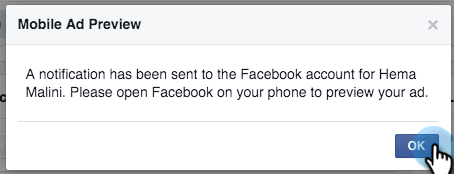
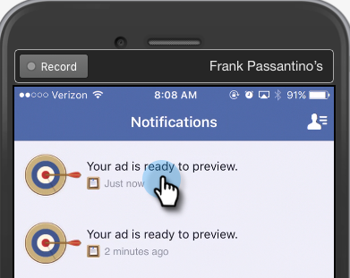
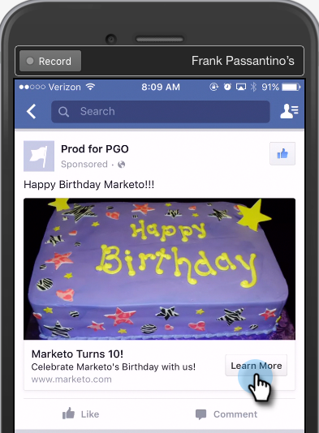

# Marketo とのモバイル統合に向けた [!DNL Facebook] リード広告のテスト {#test-facebook-lead-ads-for-mobile-integration-with-marketo}

リード広告を作成したら、テストする必要があります。

>[!PREREQUISITES]
>
>[[!UICONTROL Facebook リード広告]の統合を設定](/help/marketo/product-docs/demand-generation/facebook/set-up-facebook-lead-ads.md)する必要があります。

1. [!UICONTROL Facebook Power Editor] で、キャンペーンと広告を選択し、「**[!UICONTROL 編集]**」をクリックします。

1. 「**[!UICONTROL リンク]**」で、「**[!UICONTROL モバイルアプリで表示]**」リンクをクリックします。

   

1. 新しい通知が [!DNL Facebook] アカウントに送信され、認証済みアカウントでモバイルデバイスからアクセスできるようになります。 「**[!UICONTROL OK]**」をクリックします。

   

1. モバイルデバイスで、[!DNL Facebook] モバイルアプリの「**[!UICONTROL 通知]**」をタップします。

   

1. 「通知」で、「**[!UICONTROL 広告をプレビューする準備が整いました]**」をタップします。

   

1. コールトゥアクションをタップし、作成したフォームに入力して、テスト用リード広告ユニットを送信します。

   

   >[!NOTE]
   >
   >この例では、Call to actionの詳細を使用します。 リード広告ユニットのコールトゥアクションは異なる可能性があります。

1. フォームを送信した後、プログラムの一部として、または&#x200B;**[!UICONTROL Filled Out Facebook Lead Ads Form]** フィルターを使用するリードデータベースの一部として、[Marketo](/help/marketo/product-docs/core-marketo-concepts/smart-lists-and-static-lists/creating-a-smart-list/create-a-smart-list.md)でスマートリストを作成します。 送信したフォームのリードとフォーム名を挿入します。

   

1. 次に、「リード」タブをクリックして、同期が正しく機能していることを検証します。

   

>[!NOTE]
>
>[[!UICONTROL Facebook リード広告]](/help/marketo/product-docs/demand-generation/facebook/set-up-facebook-lead-ads.md)の設定
