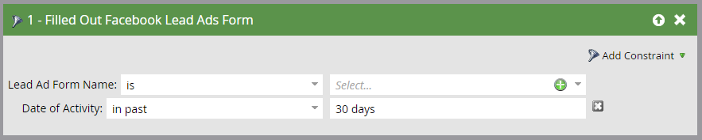

# スマートキャンペーンでリード広告のフィルターとトリガーを使用{#use-lead-ads-filters-and-triggers-in-a-smart-campaign}

facebookリード広告を有効にした場合、スマートキャンペーンで広告を使用してプログラムの成功を確認できます。 人々がFacebookリード広告ユニットで情報を送信すると、情報はすぐにMarketoに送られます。

1. **広告の入力フォーム**&#x200B;のフィルターまたはトリガーを使用します。

   

1. の追加制約があります。

   
