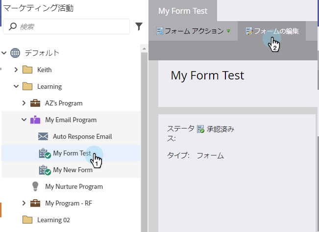
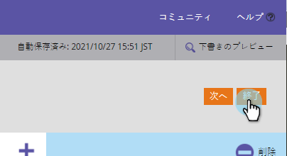

# フ追加ォームへのフィールド{#add-a-field-to-a-form}

[フォーム](/help/marketo/product-docs/demand-generation/forms/creating-a-form/create-a-form.md)を作成し、[テーマ](/help/marketo/product-docs/demand-generation/forms/creating-a-form/select-a-form-theme.md)を選択したら、ユーザーが入力するフィールドを追加できます。 これが方法です。

1. **マーケティングアクティビティ**&#x200B;に移動します。

   

1. フォームを選択し、「**フォームを編集**」をクリックします。

   

1. **+**&#x200B;記号をクリックします。

   

   >[!NOTE]
   >
   >新しいフォームを作成すると、名、姓、電子メールアドレスが自動的に追加されます。

1. フォームに追加するフィールドを探して選択します。

   

1. 必要な数追加のフィールドを作成し、[**完了**]をクリックします。

   

1. 「**承認して**&#x200B;を閉じる」をクリックします。

   

>[!NOTE]
>
>フォームの変更によって作成されたランディングページのドラフトは必ず承認してください。

全然悪くない。 頑張れ！ 次に[フォームフィールドを必須フィールドにする](/help/marketo/product-docs/demand-generation/forms/creating-a-form/make-a-form-field-required.md)方法を学びます。
