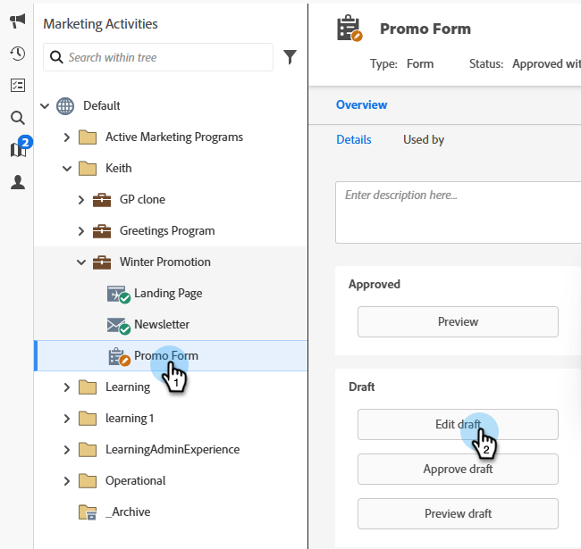
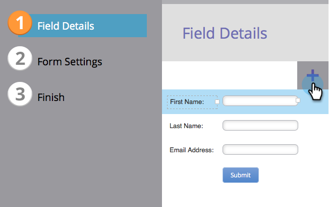

# フォームへのフィールドの追加 {#add-a-field-to-a-form}

[&#128279;](/help/marketo/product-docs/demand-generation/forms/creating-a-form/create-a-form.md)がフォームを作成し、[がテーマ &#x200B;](/help/marketo/product-docs/demand-generation/forms/creating-a-form/select-a-form-theme.md){target="_blank"}を選択した後、ユーザーが入力するフィールドを追加する場合があります。{target="_blank"}

1. **[!UICONTROL マーケティングアクティビティ]**&#x200B;に移動します。

   

1. フォームを選択し、**[!UICONTROL ドラフトを編集]**&#x200B;をクリックします

   

   >[!NOTE]
   >
   >希望するフォームが&#x200B;_Approved_&#x200B;状態にある場合は、最初に「**ドラフトを作成**」をクリックする必要があります。

1. フォームで、**+**&#x200B;記号をクリックします。

   

   >[!NOTE]
   >
   >新しいフォームを作成すると、[!UICONTROL 姓]&#x200B;[!UICONTROL 名]と[!UICONTROL メールアドレス]は自動的に追加されます。

1. フォームに追加するフィールドを探して選択します。

   

1. 必要なだけフィールドを追加して、「**[!UICONTROL 完了]**」をクリックします。

   

1. 「**[!UICONTROL 承認して閉じる]**」をクリックします。

   

>[!NOTE]
>
>フォームの変更によって作成されたランディングページの下書きを承認します。

>[!MORELIKETHIS]
>
>[&#x200B; フォームフィールドを必須にする](/help/marketo/product-docs/demand-generation/forms/creating-a-form/make-a-form-field-required.md){target="_blank"}
