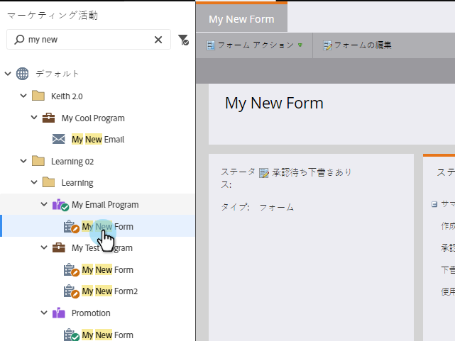

# フォームの承認{#approve-a-form}

ランディングページの1つにフォームを追加するには、承認済みのフォームが必要です。 その方法を次に示します。

## フォームの承認{#approve-a-form-1}

既存のフォームを承認して準備する方法を次に示します。

1. **マーケティングアクティビティ**&#x200B;に移動します。

   

1. フォームを検索して選択します。

   

1. 「**フォームのアクション**」で、「**承認**」をクリックします。

   

1. 緑のチェックマークに注目？

   

   承認済みで、[ランディングページ](/help/marketo/product-docs/demand-generation/landing-pages/understanding-landing-pages/approve-unapprove-or-delete-a-landing-page.md)に追加する準備ができています。

   >[!NOTE]
   >
   >承認後に行った変更は、埋め込みフォームで更新されるまでに最大4分かかる場合があります。

## エディターからのフォームの承認{#approve-a-form-from-the-editor}

フォームに変更を加える場合は、エディターから直接ページを承認できます。

>[!PREREQUISITES]
>
>* [フォームの編集](/help/marketo/product-docs/demand-generation/forms/form-actions/edit-a-form.md)

1. 「**完了**」をクリックします。

   

1. 「**承認して**&#x200B;を閉じる」をクリックします。

   

>[!NOTE]
>
>承認後にフォームを編集した場合は、変更を確認するには、[ランディングページ](/help/marketo/product-docs/demand-generation/landing-pages/understanding-landing-pages/approve-unapprove-or-delete-a-landing-page.md)を承認する必要があります。

それだ！ できるだけ簡単に。
