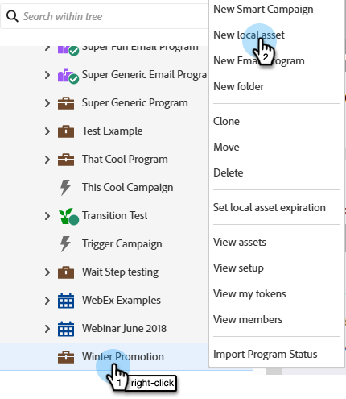

# フォームを作成する {#create-a-form}

ランディングページ上のフォームを作成および使用して、新しい名前を生成したり、目的のデータを取り込んだりします。

>[!NOTE]
>
>Marketo Engageが [ フォームの安全性を確保 ](https://nation.marketo.com/t5/Product-Documents/Forms-Service-Enhancements/ta-p/303670#M1038) するために行っていることを説明します。

1. 「**[!UICONTROL マーケティングアクティビティ]**」に移動します。

   

1. 目的のプログラムを見つけます。 そのフォルダーを右クリックして、「**[!UICONTROL 新しいローカルアセット]**」を選択します。

   

1. 「**[!UICONTROL フォーム]**」を選択します。

   

1. フォーム&#x200B;**[!UICONTROL 名前]**&#x200B;を入力し、「**[!UICONTROL 作成]**」をクリックします。

   

>[!TIP]
>
>ほとんどのユーザーは、ランディングページごとに新しいフォームを作成しますが、複数のランディングページで使用する 1 つのフォームを作成することもできます。 各自の状況に合わせて適宜にご利用ください。

>[!MORELIKETHIS]
>
>* [フォームのテーマの選択](/help/marketo/product-docs/demand-generation/forms/creating-a-form/select-a-form-theme.md)
>* [フォームへのフィールドセットの追加](/help/marketo/product-docs/demand-generation/forms/form-fields/add-a-fieldset-to-a-form.md)
