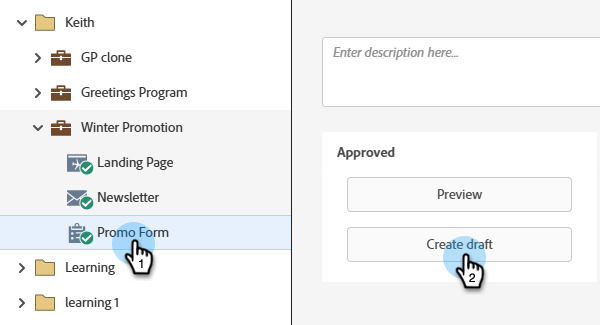

# フォームフィールドを必須にする {#make-a-form-field-required}

フォームにフィールドを[追加する場合](/help/marketo/product-docs/demand-generation/forms/creating-a-form/add-a-field-to-a-form.md){target="_blank"}は、フォームに入力するユーザーに対してフィールドの一部を必須にすることができます。

1. **[!UICONTROL マーケティングアクティビティ]**&#x200B;に移動します。

   

1. フォームを選択し、**[!UICONTROL 下書きを作成]**&#x200B;をクリックします。

   

   >[!NOTE]
   >
   >フォームが承認されていない場合は、**下書きを編集**&#x200B;をクリックします。

1. 必須にするフィールドを選択し、「**[!UICONTROL 必須]**」をオンにします。

   

1. 「**[!UICONTROL 終了]**」をクリックします。

   

1. 「**[!UICONTROL 承認して閉じる]**」をクリックします。

   

>[!NOTE]
>
>変更を公開するには、このフォームが有効になっている[&#x200B; ランディングページを承認](/help/marketo/product-docs/demand-generation/landing-pages/understanding-landing-pages/approve-unapprove-or-delete-a-landing-page.md){target="_blank"}してください。

>[!MORELIKETHIS]
>
>[&#x200B; フォームに追加したフィールドを並べ替え](/help/marketo/product-docs/demand-generation/forms/form-fields/reorder-fields-in-a-form.md){target="_blank"}
