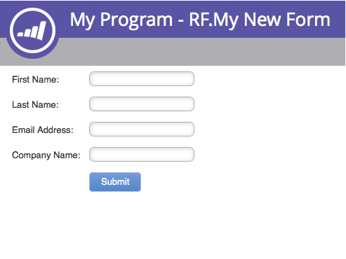
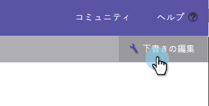
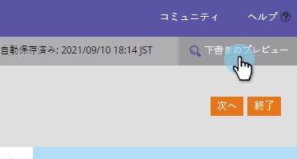

# フォームのプレビュー{#preview-a-form}

発行する前に、簡単ですばやいフォームプレビューでフォームを確認できます。

1. **マーケティング** **アクティビティ**&#x200B;に移動します。

   

1. フォームを検索して選択します。

   

1. 「**フォーム** **アクション**」で、「**プレビュー**」をクリックします。

   

1. フォームエディターが&#x200B;**プレビュー**&#x200B;モードで開きます。

   

1. 「**編集** **ドラフト**」をクリックして、**編集**&#x200B;モードに戻ります。

   

   >[!NOTE]
   >
   >**ディープダイブ**
   >
   >
   >[フォーム](http://docs.marketo.com/display/docs/forms)の詳細を表示します。

1. **プレビュー** **ドラフト**&#x200B;をクリックすると、簡単に戻ります。

   

そんなに簡単じゃなかった？ これで、変更を加える際のフォームのプレビュー方法がわかります。
