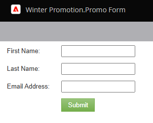

# フォームのプレビュー {#preview-a-form}

公開する前に、このクイックでシンプルなフォームプレビューアでフォームを確認できます。

1. **[!UICONTROL マーケティングアクティビティ]**&#x200B;に移動します。

   

1. フォームを選択し、「**[!UICONTROL プレビュー]**」をクリックします。

   

   >[!NOTE]
   >
   >フォームが承認されていない場合は、「**ドラフトをプレビュー**」をクリックします。

1. フォームエディターが&#x200B;_プレビュー_&#x200B;モードで開きます。

   

1. **[!UICONTROL ドラフトの編集]**&#x200B;をクリックして、_編集_&#x200B;モードに戻ります。

   

1. **[!UICONTROL ドラフトをプレビュー]**&#x200B;をクリックすると簡単に戻れます。

   
