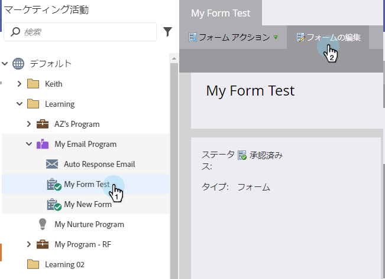
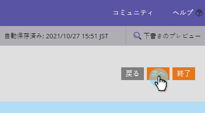

# フォームテーマの選択 {#select-a-form-theme}

私たちはあなたのフォームに素敵なテーマをたくさん作りました。 あなたはどちらが一番好きですか。

1. 「 **マーケティング** アクティビティ ****」に移動します。

   

1. フォームを選択し、「 **Edit** Form ****」をクリックします。

   

1. 「 **フォーム****設定**」に移動します。

   

1. 前後に切り替えて、好みの **フォーム****テーマ** を選択します。

   

   現在、7つの組み込みテーマがあります。

   * 単純
   * 差込枠
   * 光彩
   * 丸め
   * 濃い
   * シャドウ
   * 標準

   >[!TIP]
   >
   >フォームテーマのCSSを [編集することもできます](../../../../product-docs/demand-generation/forms/form-design/edit-the-css-of-a-form-theme.md)。

1. 「 **次へ** 」をクリックして他のフォームオプションを設定するか、「 **完了** 」をクリックしてフォームテーマを変更したい場合に限ります。

   

あれは何て簡単だったの？!HTML/CSSの本でゴミを集めるようにできます。

>[!NOTE]
>
>**関連記事**
>
>* [フォームテーマのCSSの編集](../../../../product-docs/demand-generation/forms/form-design/edit-the-css-of-a-form-theme.md)
>* [フォーム追加のフィールド](add-a-field-to-a-form.md)

>

