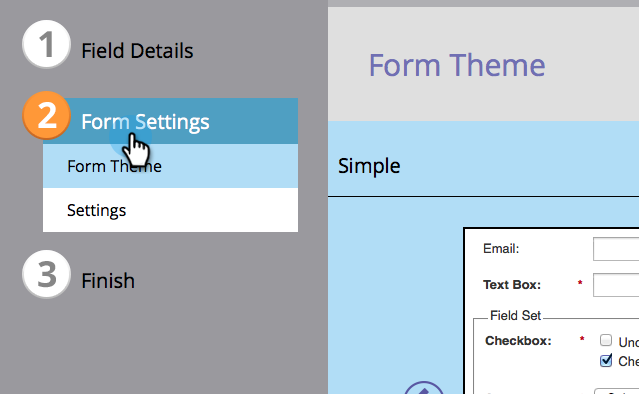

# フォームのテーマの選択 {#select-a-form-theme}

フォームのために素敵なテーマをたくさん作りました。どちらが一番お好きですか。

1. 「**[!UICONTROL マーケティングアクティビティ]**」に移動します。

   

1. フォームを選択し、「**[!UICONTROL ドラフトを作成]**」をクリックします。

   

   >[!NOTE]
   >
   >フォームが承認されていない場合は、「**ドラフトを編集**」をクリックします。

1. 「**[!UICONTROL フォームの設定]**」に移動します。

   

1. 前後に切り替えて、好みの&#x200B;**[!UICONTROL フォームテーマ]**&#x200B;を選択します。

   

   現在、7 つのビルトインのテーマがあります。

   * 簡易
   * インセット
   * 光彩
   * 四捨五入
   * 暗
   * 影
   * プレーン

   >[!TIP]
   >
   >また、[フォームテーマの CSS を編集する](/help/marketo/product-docs/demand-generation/forms/form-design/edit-the-css-of-a-form-theme.md){target="_blank"}こともできます。

1. 他のフォームオプションを設定するには「**[!UICONTROL 次へ]**」をクリックします。フォームのテーマを変更するのみの場合は、「**[!UICONTROL 完了]**」をクリックします。

   

簡単でしたね。HTML／CSS の本は読まなくても大丈夫です。

>[!MORELIKETHIS]
>
>* [フォームテーマの CSS の編集](/help/marketo/product-docs/demand-generation/forms/form-design/edit-the-css-of-a-form-theme.md){target="_blank"}
>* [フォームへのフィールドの追加](/help/marketo/product-docs/demand-generation/forms/creating-a-form/add-a-field-to-a-form.md){target="_blank"}
