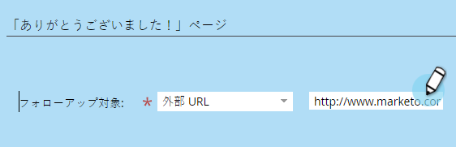
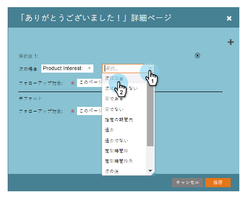
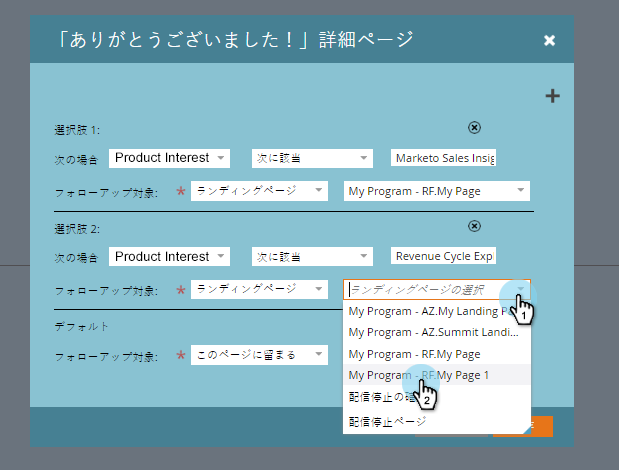
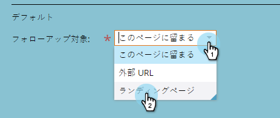

# フォームの「ありがとうございます」ページの設定{#set-a-form-thank-you-page}

誰かがフォームに入力するとどうなりますか。 彼らはどこに転送されますか。 設定方法を次に示します。

## フォーム{#edit-form}を編集

1. **マーケティング** **アクティビティ**&#x200B;に移動します。

   

1. フォームを選択し、「**フォームを編集**」をクリックします。

   

1. 「**フォーム** **設定**」で、「**設定**」をクリックします。

   

1. 「**ありがとう** **あなた** **ページ**」セクションまで下にスクロールします。

## ページを表示{#stay-on-page}

「ページに留まる」オプションを選択すると、フォームが送信された場合に、訪問者は同じページに維持されます。

1. 「**維持** **&lt;a2/>****ページ**&#x200B;の&#x200B;**フォロー** **上****」を選択します。**

   

## 外部URL {#external-url}

「外部URL」設定を使用すると、任意のURLをフォローアップページとして定義できます。 ユーザーがフォームを送信すると、指定したURLに転送されます。

1. **外部** **URL**（******フォロー****を**）を選択します。

   

1. 完全なURLを入力します。

   

>[!TIP]
>
>URLは、任意の場所でホストされているファイルのURLにすることができます。URLを指定すると、「送信」ボタンは「ダウンロード」ボタンのように動作します。

## ランディングページ{#landing-page}

承認された任意のマーケティングランディングページをフォローアップとして選択できます。

1. 「**フォローアップの対象**」を&#x200B;**ランディングページ**&#x200B;に設定します。

   

1. 目的のランディングページを探して選択します。

   

## Dynamic Thank Youページ{#dynamic-thank-you-pages}

複数のオプションを追加し、選択肢を作成して、回答に応じて異なるフォローアップを表示できます。

1. **追加** **選択肢**&#x200B;をクリックします。

   

1. 応答を監視するフィールドを選択します。

   

   >[!TIP]
   >
   >これに使用できるのは、フォームに追加されたフィールドだけです。

1. 目的の論理演算子を選択します。

   

1. ユーザーが応答する値の1つを入力します。

   

1. 「**フォロー****アップ****タイプ**」に適したページを選択します。

   

1. 適切なランディングページを選択します。

   

   >[!NOTE]
   >
   >**Reminder**
   >
   >
   >事前にこれらのランディングページを作成または承認しておく必要があります。

1. **+**&#x200B;記号をクリックして、別の選択肢を追加します。

   

   >[!NOTE]
   >
   >複数の選択肢を追加できます。 ただし、追加する数が多すぎると、フォームの読み込み速度に影響を与える可能性があるので、必要なものを追加するだけです。

1. **選択肢** **2**&#x200B;を設定します。

   

   >[!TIP]
   >
   >フォローアップタイプを自由に組み合わせることができます。 1つの選択肢にランディングページを、別の選択肢にURLを使用できます。

1. 他のすべての回答に対してデフォルトページを設定します。

   

1. ページ自体を選択し、「**保存**」をクリックします。

   

   よし、よし！

   

1. 「**完了**」をクリックします。

   

1. 「**承認して**&#x200B;を閉じる」をクリックします。

   

素晴らしい仕事！
