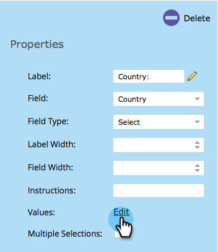

# フォームへの国選択リストの追加 {#add-a-country-picklist-to-your-form}

国フィールドをすべての国のリストを含むドロップダウンに変換するには、以下の手順に従います。

1. **マーケティング活動**&#x200B;に移動します。

   

1. フォームを選択して、「**フォームの編集**」をクリックします。

   

1. 「**+**」をクリックします。

   

1. **国**&#x200B;を選択します。

   

1. **国**&#x200B;フィールドが選択したままで、**フィールドのタイプ**&#x200B;を&#x200B;**選択**&#x200B;に変更します。

   

1. **値**&#x200B;を&#x200B;**編集**&#x200B;して、ユーザーが選択できる国のリストを追加します。

   

1. **詳細****エディター**&#x200B;をクリックします。

   

1. 次の国のリストを選択してコピーします。

   ```
   Afghanistan Albania Algeria Andorra Angola Antigua & Deps Argentina Armenia Australia Austria Azerbaijan Bahamas Bahrain Bangladesh Barbados Belarus Belgium Belize Benin Bhutan Bolivia Bosnia Herzegovina Botswana Brazil Brunei Bulgaria Burkina Burundi Cambodia Cameroon Canada Cape Verde Central African Rep Chad Chile China Colombia Comoros Congo Congo (Democratic Rep) Costa Rica Croatia Cuba Cyprus Czech Republic Denmark Djibouti Dominica Dominican Republic East Timor Ecuador Egypt El Salvador Equatorial Guinea Eritrea Estonia Ethiopia Fiji Finland France Gabon Gambia Georgia Germany Ghana Greece Grenada Guatemala Guinea Guinea-Bissau Guyana Haiti Honduras Hungary Iceland India Indonesia Iran Iraq Ireland (Republic) Israel Italy Ivory Coast Jamaica Japan Jordan Kazakhstan Kenya Kiribati Korea North Korea South Kosovo Kuwait Kyrgyzstan Laos Latvia Lebanon Lesotho Liberia Libya Liechtenstein Lithuania Luxembourg Macedonia Madagascar Malawi Malaysia Maldives Mali Malta Marshall Islands Mauritania Mauritius Mexico Micronesia Moldova Monaco Mongolia Montenegro Morocco Mozambique Myanmar (Burma) Namibia Nauru Nepal Netherlands New Zealand Nicaragua Niger Nigeria Norway Oman Pakistan Palau Panama Papua New Guinea Paraguay Peru Philippines Poland Portugal Qatar Romania Russian Federation Rwanda St Kitts & Nevis St Lucia Saint Vincent & the Grenadines Samoa San Marino Sao Tome & Principe Saudi Arabia Senegal Serbia Seychelles Sierra Leone Singapore Slovakia Slovenia Solomon Islands Somalia South Africa South Sudan Spain Sri Lanka Sudan Suriname Swaziland Sweden Switzerland Syria Taiwan Tajikistan Tanzania Thailand Togo Tonga Trinidad & Tobago Tunisia Turkey Turkmenistan Tuvalu Uganda Ukraine United Arab Emirates United Kingdom United States Uruguay Uzbekistan Vanuatu Vatican City Venezuela Vietnam Yemen Zambia Zimbabwe
   ```

1. エディターにリストを貼り付けます。

   

   >[!TIP]
   >
   >リストを自由に編集したり、他のリストを使用したりできます。

1. 「**保存**」をクリックします。

   

1. 「**終了**」をクリックします。

   

1. 「**承認して終了**」をクリックします。

   

   これで完了です。これで、フォームに入力したユーザーは、提供した国のリストから選択できます。

   

とても簡単だったので、他に何かしてみましょう。ユーザーがリストで米国を国として選択した場合に、州フィールドを動的に表示する方法を見てみましょう。その方法については、以下の関連記事を参照してください。

>[!MORELIKETHIS]
>
>[フォームフィールドの表示設定の動的な切り替え](/help/marketo/product-docs/demand-generation/forms/form-fields/dynamically-toggle-visibility-of-a-form-field.md)
