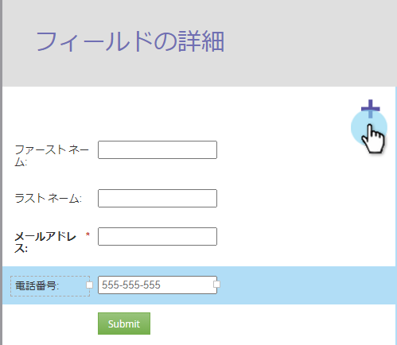
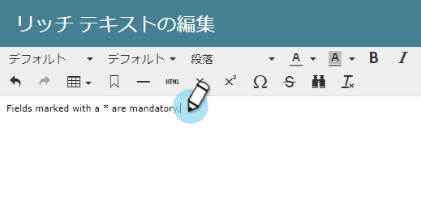
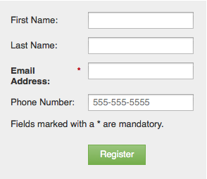

# フ追加ォーム{#add-rich-text-to-a-form}へのリッチテキスト

フォームのリッチテキストを使用して、フィールド間に手順やその他の情報を追加します。 見て。

1. **マーケティング** **アクティビティ**&#x200B;に移動します。

   

1. フォームを選択し、「**編集** **フォーム**」をクリックします。

   

1. **+**&#x200B;記号をクリックします。

   

1. 「**リッチテキスト**」を選択します。

   

1. 目的のテキストを入力します。

   

   >[!TIP]
   >
   >フォームに区切り線が必要な場合は、「水平線」ボタンを使用します。

1. 「**保存**」をクリックします。

   

1. 「**完了**」をクリックします。

   

1. 「**承認して**&#x200B;を閉じる」をクリックします。

   

   うまくいった！ 見て。

   

>[!NOTE]
>
>**ディープダイブ**
>
>[フォーム](http://docs.marketo.com/display/docs/forms)の詳細を表示します。

リッチテキストブロックに[表示ルール](../../../../product-docs/demand-generation/forms/form-fields/dynamically-toggle-visibility-of-a-form-field.md)を追加することもできるのをご存じでしたか？