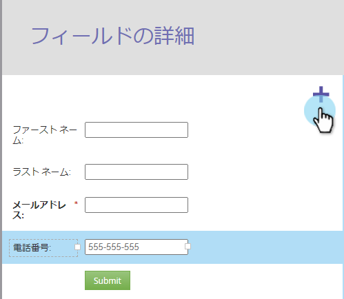
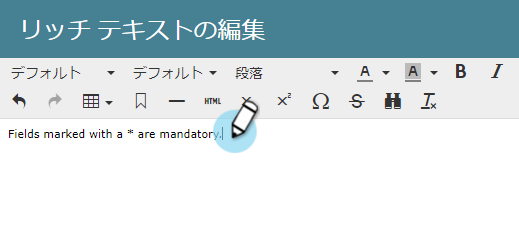

# フォームへのリッチテキストの追加 {#add-rich-text-to-a-form}

フィールド間に手順やその他の情報を追加するには、フォームでリッチテキストを使用します。

1. **[!UICONTROL マーケティングアクティビティ]**&#x200B;に移動します。

   

1. フォームを選択し、「**[!UICONTROL フォームの編集]**」をクリックします。

   

1. 「**+**」をクリックします。

   

1. 「**[!UICONTROL リッチテキスト]**」を選択します。

   

1. 使用するテキストを入力します。

   

   >[!TIP]
   >
   >フォームに区切り記号が必要な場合は、「横線」ボタンを使用します。

1. 「**[!UICONTROL 保存]**」をクリックします。

   

1. 「**[!UICONTROL 終了]**」をクリックします。

   

1. 「**[!UICONTROL 承認して閉じる]**」をクリックします。

   

   

>[!TIP]
>
>リッチテキストブロックには[表示ルールを追加](/help/marketo/product-docs/demand-generation/forms/form-fields/dynamically-toggle-visibility-of-a-form-field.md)することもできます。
