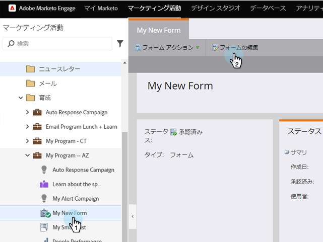
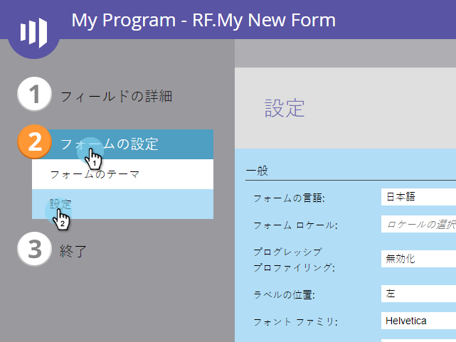
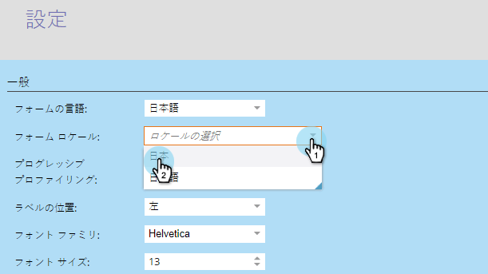
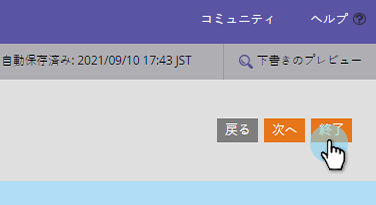
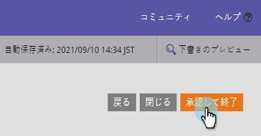
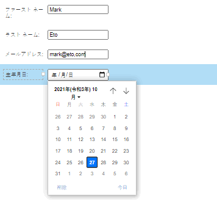

# フォームのロケールの変更{#change-a-forms-locale}

国際フォームを扱う場合は、日付/時間を正しい形式で表示する必要があります。 Marketoが自動的にこれを行うので、フォームのロケールを設定するだけで、残りの作業はアドビが行います。

1. **マーケティングアクティビティ**&#x200B;に移動します。

   

1. フォームを選択し、「**フォームを編集**」をクリックします。

   

1. 「**フォーム設定**」で、「**設定**」をクリックします。

   

1. 任意の&#x200B;**ロケール**&#x200B;を選択します。

   

1. 「**完了**」をクリックします。

   

1. **「承認して**&#x200B;を閉じる」をクリックして、変更を適用し、保存します。

   >[!NOTE]
   >
   >フォームをランディングページで使用するには、承認する必要があります。

   

   >[!NOTE]
   >
   >フォームの変更によって作成されたランディングページドラフト](/help/marketo/product-docs/demand-generation/landing-pages/understanding-landing-pages/approve-unapprove-or-delete-a-landing-page.md)を[承認することを忘れないでください。

   それだ！ 正しいロケールで日付/時間が表示されていることを確認できます。

   
