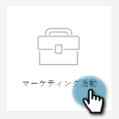
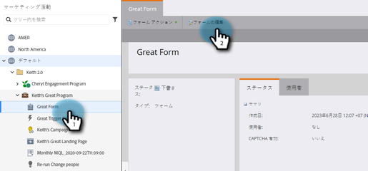
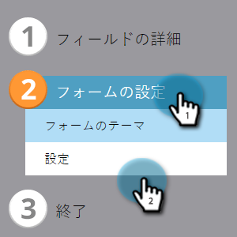
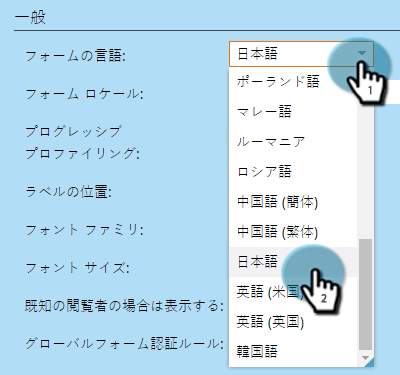
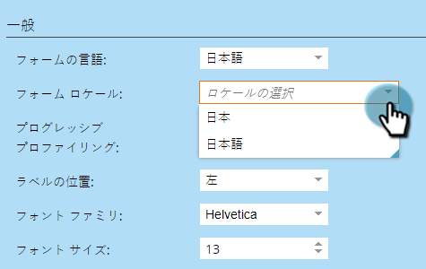
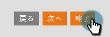
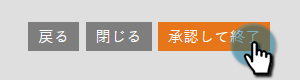
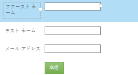

# フォームの言語の変更 {#change-the-language-of-a-form}

フォームの言語を変更する方法を説明します。

>[!IMPORTANT]
>
>この記事の手順に従うと、Marketo 標準フィールドの言語と、送信ボタンのラベルで使用される文言が変更されます。 [カスタムフィールド](/help/marketo/product-docs/administration/field-management/create-a-custom-field-in-marketo.md){target="_blank"}は翻訳されません。

1. **マーケティングアクティビティ**&#x200B;に移動します。

   

1. フォームを選択し、「**フォームの編集**」をクリックします。

   

1. 「**フォーム設定**」をクリックし、「**設定**」を選択します。

   

1. 目的の&#x200B;**フォームの言語**&#x200B;を選択します。

   

   オプションの手順：選択した言語のロケール／地域を選択します。

   

1. 「**終了**」をクリックします。

   

1. **承認して閉じる**&#x200B;をクリックして、変更を適用して保存します。

   

   >[!NOTE]
   >
   >ランディングページでフォームを使用するには、承認が必要です。

   >[!TIP]
   >
   >必ず、フォームの変更によって作成された[ランディングページのドラフトを承認](/help/marketo/product-docs/demand-generation/landing-pages/understanding-landing-pages/approve-unapprove-or-delete-a-landing-page.md)してください。

これで、選択した言語がフォームに反映されます。

