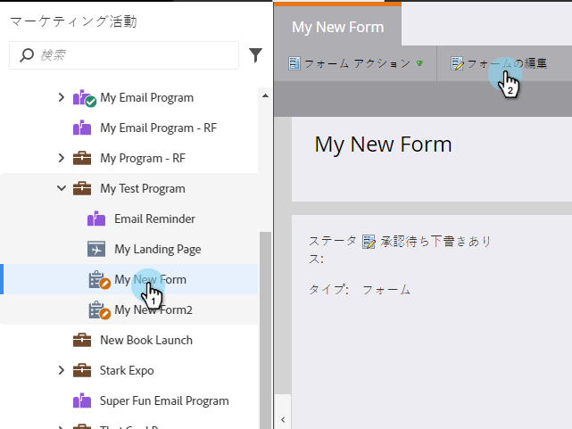
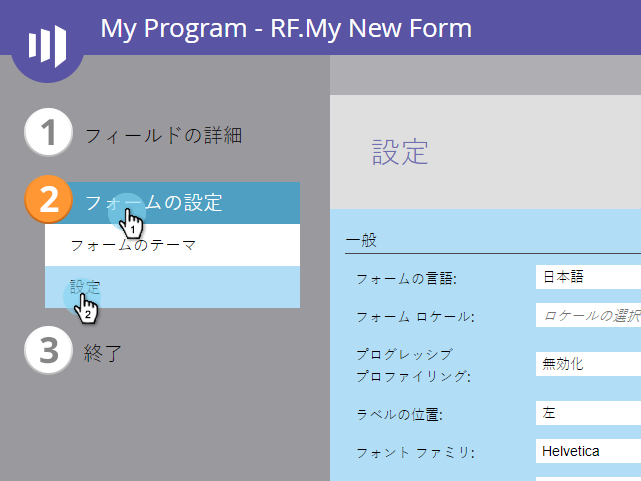
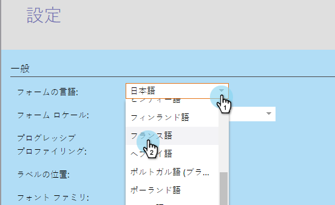
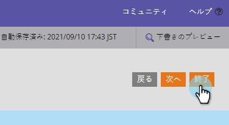

# フォームの検証/エラーメッセージおよび送信ボタンの言語の変更{#change-the-language-of-form-validation-error-messages-and-submit-button}

フォームをカスタマイズして別の言語でメッセージを表示できることをご存じですか。 これを見て。

>[!NOTE]
>
>送信ボタンの言語も変更されます。

1. **マーケティングアクティビティ**&#x200B;に移動します。

   

1. フォームを選択し、「**フォームを編集**」をクリックします。

   

1. 「**フォーム設定**」で、「**設定**」をクリックします。

   

1. 必要な&#x200B;**エラー言語**&#x200B;を選択します。

   

1. 「**完了**」をクリックします。

   

1. **「承認して**&#x200B;を閉じる」をクリックして、変更を適用し、保存します。

   >[!NOTE]
   >
   >フォームをランディングページで使用するには、承認する必要があります。

   

   >[!NOTE]
   >
   >フォームの変更によって作成されたランディングページ](/help/marketo/product-docs/demand-generation/landing-pages/understanding-landing-pages/approve-unapprove-or-delete-a-landing-page.md)のドラフトを[承認することを忘れないでください。

   

さあ、 フォームの検証メッセージとエラーメッセージが、お使いの言語で表示されます。
