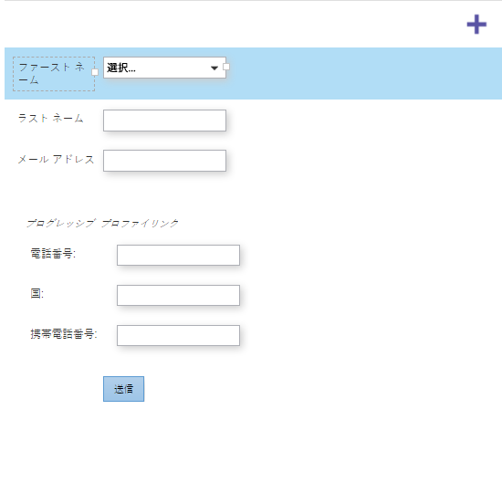

# フォームのプログレッシブプロファイルの設定 {#configure-form-progressive-profiling}

短い形は良い！ フォームに戻ったユーザーは、新しいフィールドを提示し、訪問者のプロファイルを順を追って入力できます。 これが方法です。

>[!NOTE]
>
>この機能を正しく動作させるには、「フォームの事前入力」が表示フィールドに対して有効になっていること、非表示フィールドに対して [無効になっていることを確認します](http://docs.marketo.com/display/DOCS/Disable+Pre-fill+for+a+Form+Field) 。

1. 「 **マーケティング** アクティビティ ****」に移動します。

   

1. フォームを選択し、「 **Edit** Form ****」をクリックします。

   

1. 「 **フォーム****設定**」で、「 **設定**」をクリックします。

   

1. [ **プログレッシブ****プロファイル** ]を[ **有効]に設定します**。

   

1. では、設定を行います。 「 **フィールド****詳細」に移動します**。

   
プログレッシブプロファイルセットに含まれるすべてのフィールドをドラッグ&amp;ドロップします。
   

1. すべてのフィールドの移動が完了すると、次のようになります。

   

   >[!NOTE]
   >
   >「 **プログレッシブ****プロファイリング** 」ボックスの外側のフィールドは、入力済みのフィールドでも常にフォームに表示されます。

1. 「 **プログレッシブ** ・ **プロファイリング** 」ボックスを選択します。

   

   >[!CAUTION]
   >
   >プログレッシブプロファイルで必須フィールドを使用する場合は注意が必要です。 他のフィールドのデータを以前に送信した後に新しい電子メールアドレスを訪問者が入力した場合は（新しい人を作成する）、これらのフィールドを空白のままにしておくことができます。これは、最新のフォームでは省略されます。

1. 次に、「 **プログレッシブ****プロファイリング** 」ボックスから、常に表示する空白のフィールドの数を選択します。

   

   >[!NOTE]
   >
   >**例**
   >
   >
   >「 **Number** of **** Number **of****Blank** Fields」に「1」を指定した場合、訪問者はこのフォームを初めて表示したときに次のように表示されます。
   >
   >    
   >    
   >    * 名（空）
   >    * 姓（空）
   >    * 電子メールアドレス（空）
   >    * 電話番号（空）

   >    
   >    
   >2回目にフィールドに入力した場合は、次のように表示されます。
   >
   >    
   >    
   >    * 名（事前入力）
   >    * 姓（事前入力済み）
   >    * 電子メールアドレス（事前入力）
   >    * 携帯電話番号（空）

   >    
   >    
   >「携帯電話番号」に入力した場合、3回目に訪問すると次の情報が表示されます。
   >
   >    
   >    
   >    * 名（事前入力）
   >    * 姓（事前入力済み）
   >    * 電子メールアドレス（事前入力）
   >    * 国（空）

1. 「 **完了**」をクリックします。

   

1. 「 **承認して閉じる**」をクリックします。

   

いい仕事！ 君が今した仕事が報われる。

この機能を試してみて、必ずテストしてください。 高度な機能ですが、この方法でフォームを非常にダイナミックにすることができます。
