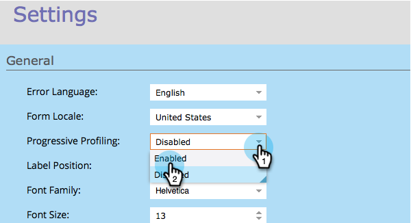
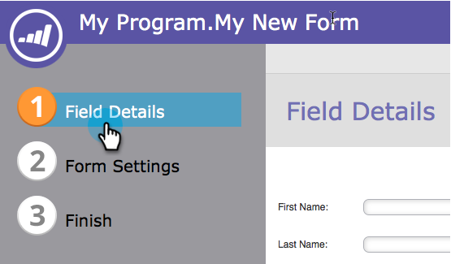
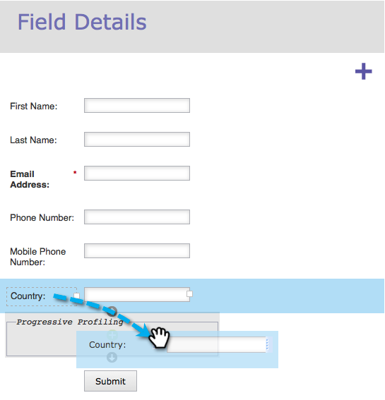
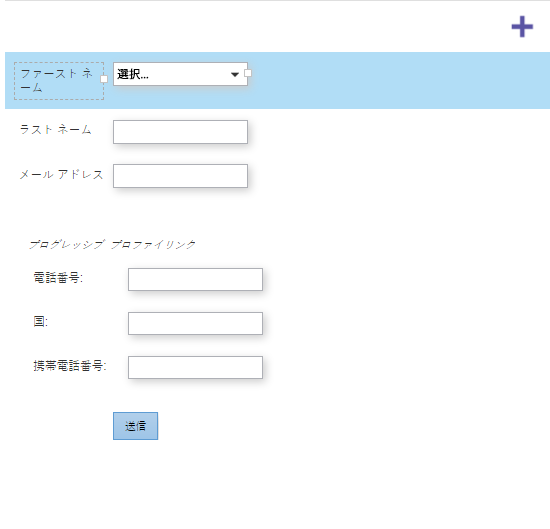
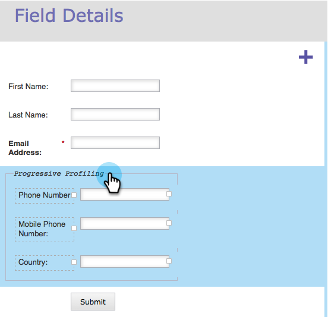
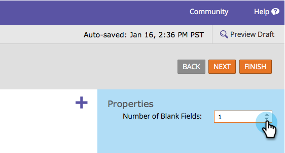
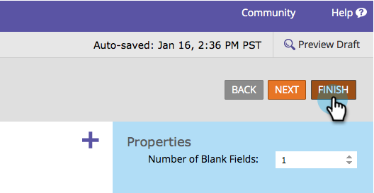
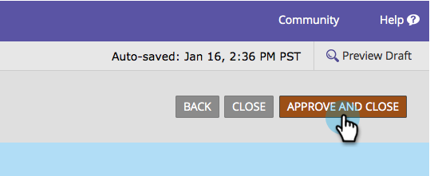

# フォームのプログレッシブプロファイリングの設定 {#configure-form-progressive-profiling}

短いフォームは最高です。 誰かがフォームに戻ると、新しいフィールドを提示し、訪問者のプロファイルを徐々に入力できます。 手順は以下のとおりです。

>[!NOTE]
>
>この機能を正しく動作させるには、フォームの事前入力が表示されるフィールドに対しては有効になっていて、非表示のフィールドに対しては[無効](/help/marketo/product-docs/demand-generation/forms/form-fields/disable-pre-fill-for-a-form-field.md)になっていることを確認してください。

1. **[!UICONTROL マーケティングアクティビティ]**&#x200B;に移動します。

   

1. フォームを選択し、「**[!UICONTROL フォームの編集]**」をクリックします。

   

1. 「**[!UICONTROL フォームの設定]**」で「**[!UICONTROL 設定]**」をクリックします。

   

1. **[!UICONTROL プログレッシブプロファイル]**&#x200B;を「**[!UICONTROL 有効]**」に設定します。

   

1. 次に、設定します。 **[!UICONTROL フィールドの詳細]**&#x200B;に移動します。

   

1. プログレッシブプロファイルセットに含まれるすべてのフィールドをドラッグ＆ドロップします。

   

1. すべてのフィールドの移動が完了すると、次のようになります。

   

   >[!NOTE]
   >
   >**[!UICONTROL プログレッシブプロファイル]**&#x200B;ボックスの外側のフィールドは、入力されている場合でも、常にフォームに表示されます。

1. **[!UICONTROL プログレッシブプロファイル]**&#x200B;ボックスを選択します。

   

   >[!CAUTION]
   >
   >[!UICONTROL プログレッシブプロファイル]で必須フィールドを使用する場合は注意が必要です。 訪問者が他のフィールドのデータを以前に送信した後に新しいメールアドレスを入力した場合（これにより、新しいユーザーが作成されます）、これらのフィールドは最新のフォームで抑制されるので、空白のままになることがあります。

1. 次に、任意の時点で&#x200B;**プログレッシブプロファイリング**&#x200B;ボックスからユーザーに表示する空白のフィールドの数を選択します。

   

   >[!NOTE]
   >
   >**[!UICONTROL 空のフィールド数]**&#x200B;を 1 とすると、訪問者はこのフォームを初めて表示したときに、次のように表示されます。
   >
   >* 名（空）
   >* 姓（空）
   >* メールアドレス（空）
   >* 電話番号（空）
   >
   >2 回目に各フィールドに入力すると、次のように表示されます。
   >
   >* 名（事前入力済み）
   >* 姓（事前入力済み）
   >* メールアドレス（事前入力済み）
   >* 携帯電話番号（空）
   >
   >携帯電話番号を入力すると、3 回目の訪問時には次のように表示されます。
   >
   >* 名（事前入力済み）
   >* 姓（事前入力済み）
   >* メールアドレス（事前入力済み）
   >* 国（空）

1. 「**[!UICONTROL 終了]**」をクリックします。

   

1. 「**[!UICONTROL 承認して閉じる]**」をクリックします。

   

この機能を試して、テストしてください。 これは高度に機能しますが、この方法でフォームを非常に動的にすることができます。
