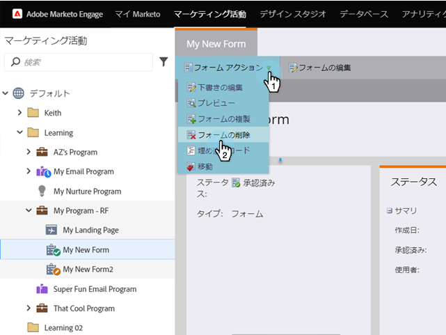
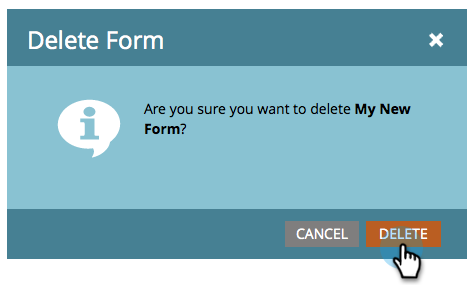

# フォームの削除{#delete-a-form}

不要で使用されていないフォームがある場合は、それを削除できます。 これが方法です。

1. **マーケティングアクティビティ**&#x200B;に移動します。

   

1. フォームを検索して選択します。

   

1. 「**フォームのアクション**」で、「**フォームを削除**」をクリックします。

   

   >[!NOTE]
   >
   >フォームを使用しているすべてのランディングページから必ずフォームを削除してください。 また、フォームが公開Webサイトで使用されていないことを確認します。

1. 「**削除**」をクリックして、確認します。

   

1. フォームがMarketoランディングページで使用されている場合は、そのフォームを削除することはできません。 ランディングページの中にあるものは何でも取り除かなければなりません

   

>[!CAUTION]
>
>パブリックWebサイトで使用されているフォームを削除すると、警告は表示されず、フォームが壊れます。 代わりに[アーカイブ](/help/marketo/product-docs/email-marketing/drip-nurturing/using-stream-content/archive-and-unarchive-stream-content.md)をお勧めします。
