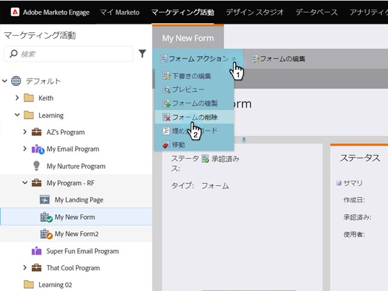

# フォームの削除 {#delete-a-form}

不要で使用されていないフォームがある場合は、 手順は以下のとおりです。

1. **[!UICONTROL マーケティングアクティビティ]**&#x200B;に移動します。

   

1. フォームを見つけて選択します。

   

1. 「**[!UICONTROL フォームアクション]**」で、「**[!UICONTROL フォームを削除]**」をクリックします。

   

   >[!NOTE]
   >
   >フォームは必ず、フォームを使用しているすべてのランディングページから削除してください。 また、フォームが公開web サイトで使用されていないことを確認します。

1. 「**[!UICONTROL 削除]**」をクリックして確認します。

   

1. フォームが Marketo のランディングページで使用されている場合、そのフォームを削除することはできません。 フォームが存在しているランディングページまで移動して、フォームを削除する必要があります。

   

>[!CAUTION]
>
>公開 Web サイトで使用されているフォームを削除した場合、警告は表示されず、フォームが壊れます。 代わりに、[アーカイブ](/help/marketo/product-docs/email-marketing/drip-nurturing/using-stream-content/archive-and-unarchive-stream-content.md)することを検討してください。
