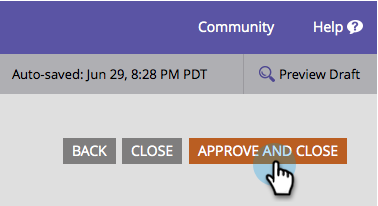

# ソーシャルフォーム入力を無効にする {#disable-social-form-fill}

サイトの訪問者にソーシャルプロファイルを使用してフォームを送信してほしくない場合があります。 無効化の方法を説明しましょう。

>[!AVAILABILITY]
>
>すべてのお客様がこの機能を購入しているわけではありません。

1. **[!UICONTROL マーケティングアクティビティ]**&#x200B;に移動します。

   

1. フォームを選択し、「**[!UICONTROL フォームの編集]**」をクリックします。

   

1. 「[!UICONTROL フォームの設定]」で「**[!UICONTROL 設定]**」をクリックします。

   

1. 含めないソーシャルネットワークのチェックをオフにします。

   

1. 「**[!UICONTROL 終了]**」をクリックします。

   

1. 「**[!UICONTROL 承認して閉じる]**」をクリックします。

   
