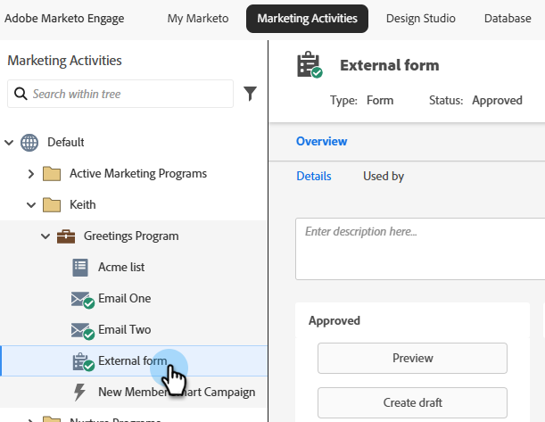
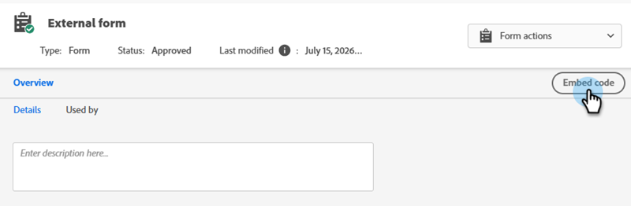

# Web サイトへのフォームの埋め込み {#embed-a-form-on-your-website}

フォームの埋め込みコードにアクセスして、自分のweb サイトでホストします。

>[!PREREQUISITES]
>
>埋め込みコードを使用できるようにするには、フォームを承認する必要があります。

1. 目的のフォームを見つけて選択します。

   

1. フォームの詳細画面の右側にある「**[!UICONTROL コードを埋め込む]**」をクリックします。

   

   >[!CAUTION]
   >
   >**[フォームの事前入力](/help/marketo/product-docs/administration/settings/edit-landing-page-settings.md)**&#x200B;は独自のページ&#x200B;_または_ Marketo のランディングページでフォーム埋め込みコードを使用する場合には機能しません。 フォームの事前入力は、フォームが「要素を挿入」オプションを使用して Marketo ランディングページで使用されている場合にのみ機能します。

1. 「_標準_」タブで、「**[!UICONTROL テキストをコピー]**」をクリックします。 終了したら「**[!UICONTROL 閉じる]**」をクリックします。

   

   >[!NOTE]
   >
   >Lightbox コードについては、[Lightboxでのフォームの使用](/help/marketo/product-docs/demand-generation/forms/form-actions/use-a-form-in-a-lightbox.md)を参照してください。

1. web開発者に埋め込みコードを提供します。

   コードをweb サイトに埋め込んだ後、Marketo Engageでフォームに変更を加えると、フォーム承認時にサイトにプッシュされます。 コードを変更する必要はありません。

   >[!TIP]
   >
   >デベロッパーが外観をカスタマイズしたり、高度な API 関数にアクセスしたりしたい場合は、[Forms 2.0 のデベロッパー向けページ](https://experienceleague.adobe.com/ja/docs/marketo-developer/marketo/javascriptapi/forms-api-reference)について知らせてください。
