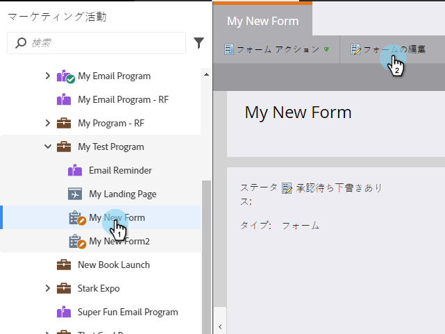
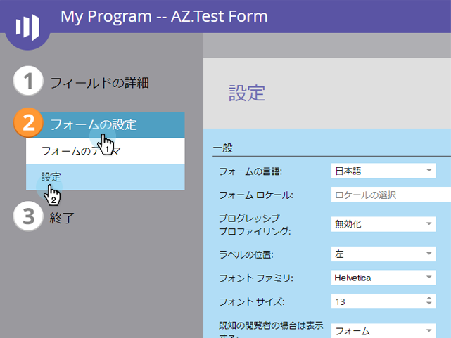
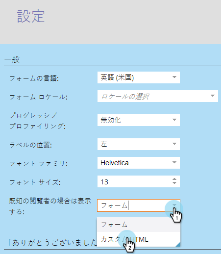
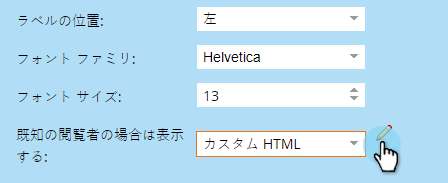
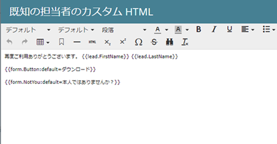
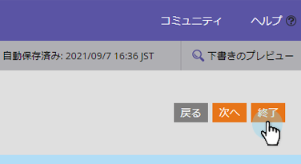
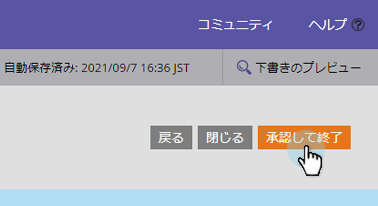
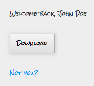

# 既知のユーザーにカスタムHTMLフォームを表示 {#show-custom-html-form-for-known-people}

訪問者がCookieを使用している場合（過去に電子メールアドレスを提供した既知の人）、フォームで迷惑を掛けるのはなぜですか。 ダウンロードボタンを押すだけです。 これが方法です。

1. 「 **マーケティング** アクティビティ ****」に移動します。

   

1. 「 **マーケティング****アクティビティ**」で、フォームを選択し、「フォームを編集」「フォ **ームを編集」をクリック******&#x200B;します。

   

1. 「 **Form** **Settings**」で、「 **Settings**」をクリックします。

   

1. Set If **Known****訪問者、Show**:を **Custom** **HTMLに追加します**。

   

1. 「  」をクリックして、既知のユーザーに表示する **カスタム** HTML **** を編集します。

   

1. デフォルトのコンテンツがいくつかありますが、自由に変更してください。

   

   使用可能なトークン：

   | トークン | 説明 |
   |---|---|
   | `{{lead.FirstName}}` | これにより、ユーザーの名が表示されます。 |
   | `{{lead.LastName}}` | これにより、ユーザーの姓が表示されます。 |
   | `{{form.Button:default=Download}}` | これにより、フォームボタンが表示されます。 ボタンのテキストを変更するには、の後 `=` の領域を置き換えます。 |
   | `{{form.NotYou:default=Not you?}}` | これにより、その人物が他の人物である場合に備えて、リンクが表示されます。 リンクテキストを変更するには、の後の領域 `=` を置き換えます。 |

   >[!CAUTION]
   >
   >上記の4つのトークンのみを使用できます。 ここでは、他のトークンは動作しません。

1. 「 **完了**」をクリックします。

   

1. 「 **承認して閉じる**」をクリックします。

   >[!NOTE]
   >
   >フォームをランディングページで使用するには、承認する必要があります。

   

   >[!NOTE]
   >
   >**Reminder**
   >
   >
   >フォームの変更によって [作成されたランディングページのドラフトを忘れずに](../../../../product-docs/demand-generation/landing-pages/understanding-landing-pages/approve-unapprove-or-delete-a-landing-page.md) 承認します。

   

   >[!TIP]
   >
   >フォームのフォローアップページをファイルのURLに設定することで、ボタンのクリックをアセットに向けることができます。

ケーキ切れ！ 同じフォームに戻った場合、訪問者に表示される内容を調べます。