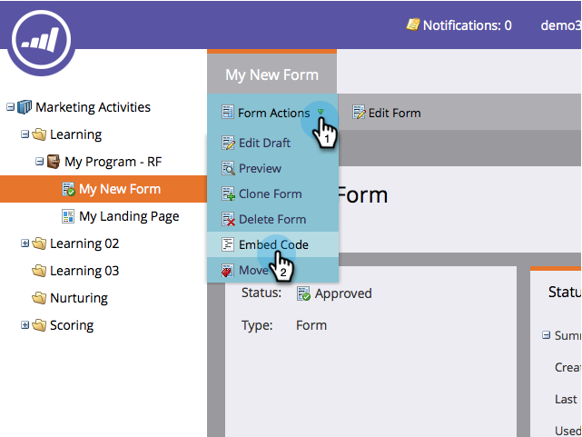

# Lightbox でのフォームの使用 {#use-a-form-in-a-lightbox}

Lightbox は、フォームを表示したいときにコンテンツの前にフォームを開く技術です。手順は次のとおりです。

1. **[!UICONTROL マーケティングアクティビティ]**&#x200B;に移動します。

   

1. フォームを見つけて選択します。

   

1. 「**[!UICONTROL フォームアクション]**」で、「**[!UICONTROL 埋め込みコード]**」をクリックします。

   >[!NOTE]
   >
   >埋め込みコード項目を表示／使用できるようにするには、フォームを承認する必要があります。

   

1. **[!UICONTROL コードタイプ]**&#x200B;を **[!UICONTROL Lightbox]** に設定します。

   

1. コードを選択またはコピーして、「**[!UICONTROL 閉じる]**」をクリックします。

   

コードを Web デベロッパーに渡し、Web サイトに追加してもらいます。

すばらしいです。
