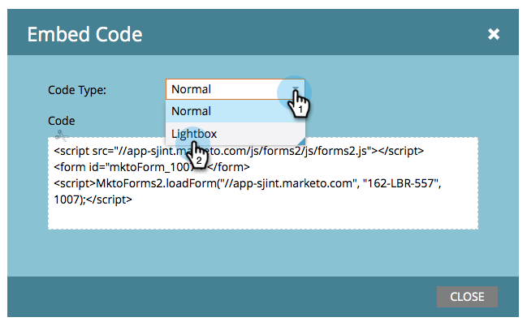

# ライトボックスでのフォームの使用{#use-a-form-in-a-lightbox}

ライトボックスは、コンテンツを表示したいときに、コンテンツの前にフォームを開く手法です。 これが方法です。

1. **マーケティングアクティビティ**&#x200B;に移動します。

   

1. フォームを検索して選択します。

   

1. 「**フォームアクション**」で、「**埋め込みコード**」をクリックします。

   >[!NOTE]
   >
   >埋め込みコード項目を表示/使用するには、フォームが承認されている必要があります。

   

1. **コードタイプ**&#x200B;を&#x200B;**ライトボックス**&#x200B;に設定します。

   

1. コードを選択/コピーし、「**閉じる**」をクリックします。

   

コードをWeb開発者に渡して、Webサイトに追加してもらいます。

素晴らしい仕事！
