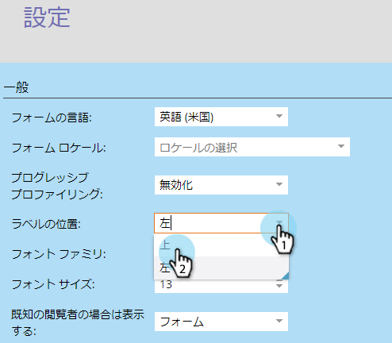

# フォームラベルの位置の変更 {#change-form-label-position}

[フォーム](/help/marketo/product-docs/demand-generation/forms/creating-a-form/create-a-form.md)を作成する場合、フォームフィールドラベルの位置を簡単に変更できます。 どうやって。

1. **マーケティングアクティビティ**&#x200B;に移動します。

   

1. フォームを選択し、「**フォームを編集**」をクリックします。

   

1. **設定**&#x200B;を選択します。

   

1. 必要な&#x200B;**ラベルの位置**&#x200B;を選択します。

   

   現在、次の2つのオプションがあります。

   * 左（デフォルト）
   * 上

1. 「**完了**」をクリックします。

   

1. 「**承認して閉じる**」をクリックします。

   >[!NOTE]
   >
   >ランディングページでフォームを使用するには、承認が必要です。

   

   >[!NOTE]
   >
   >必ず、フォームの変更によって作成されたランディングページのドラフトを承認してください。

よくやった！ フォーム上のラベルの位置を簡単に変更する方法 フォームラベルのフォントを変更する場合に実行できる操作を見てみましょう。

>[!MORELIKETHIS]
>
>[フォームフォントファミリの変更](/help/marketo/product-docs/demand-generation/forms/form-design/change-the-form-font-family.md)>
>
