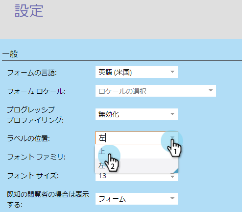

# フォームラベルの位置の変更 {#change-form-label-position}

[フォーム](/help/marketo/product-docs/demand-generation/forms/creating-a-form/create-a-form.md)を作成する場合、フォームフィールドラベルの位置を簡単に変更できます。 手順は以下のとおりです。

1. **[!UICONTROL マーケティングアクティビティ]**&#x200B;に移動します。

   

1. フォームを選択し、「**[!UICONTROL フォームの編集]**」をクリックします。

   

1. 「**[!UICONTROL 設定]**」を選択します。

   

1. 必要な&#x200B;**[!UICONTROL ラベルの位置]**&#x200B;を選択します。

   

   現在、次の 2 つのオプションがあります。

   * [!UICONTROL 左]（デフォルト）
   * [!UICONTROL 上]

1. 「**[!UICONTROL 終了]**」をクリックします。

   

1. 「**[!UICONTROL 承認して閉じる]**」をクリックします。

   >[!NOTE]
   >
   >ランディングページでフォームを使用するには、承認が必要です。

   

   >[!NOTE]
   >
   >必ず、フォームの変更によって作成されたランディングページのドラフトを承認してください。

>[!MORELIKETHIS]
>
>[フォームフォントファミリの変更](/help/marketo/product-docs/demand-generation/forms/form-design/change-the-form-font-family.md)
