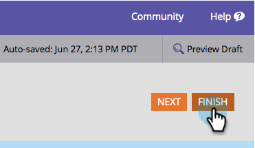

# フォーム送信ボタンテキストの変更{#change-form-submit-button-text}

フォームボタンは、「送信」から他の任意の単語にすばやく簡単に変更できます。 これが方法です。

1. **マーケティング** **アクティビティ**&#x200B;に移動します。

   

1. フォームを選択し、「**編集** **フォーム**」をクリックします。

   

1. ボタンを選択し、**ラベル**&#x200B;を変更します。

   

   >[!TIP]
   >
   >「待機中ラベル」も変更できます。 これは、ボタンがクリックされた後、およびフォーム送信アクションが完了する前に表示されます。

1. 「**完了**」をクリックします。

   

1. 「**承認して**&#x200B;を閉じる」をクリックします。

   

   バム！

   

