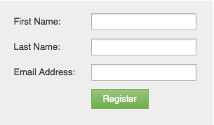

# フォーム送信ボタンのテキストの変更 {#change-form-submit-button-text}

フォームボタンを「送信」から他の単語にすばやく簡単に変更できます。 手順は以下のとおりです。

1. **[!UICONTROL マーケティングアクティビティ]**&#x200B;に移動します。

   

1. フォームを選択し、「**[!UICONTROL フォームの編集]**」をクリックします。

   

1. ボタンを選択し、**[!UICONTROL ラベル]**&#x200B;を変更します。

   

   >[!TIP]
   >
   >また、待機中ラベルを変更することもできます。 これは、ボタンがクリックされた後、およびフォーム送信アクションが終了する前に表示されます。

1. 「**[!UICONTROL 終了]**」をクリックします。

   

1. 「**[!UICONTROL 承認して閉じる]**」をクリックします。

   

   
