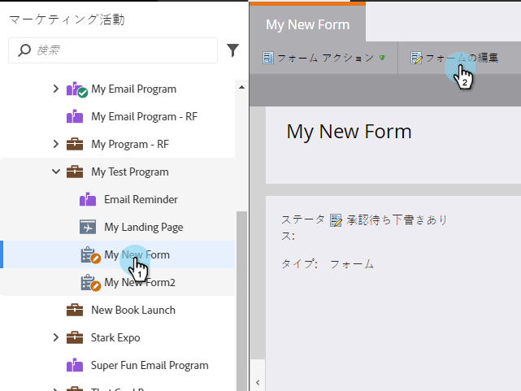
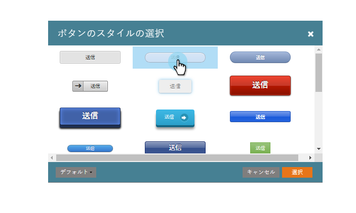
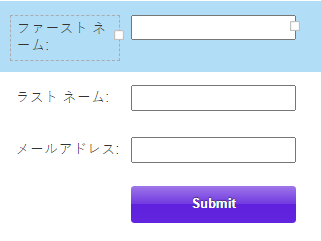

# 送信ボタンのスタイルとカラーの変更 {#change-submit-button-style-and-color}

標準の送信ボタンがさえないと感じる場合や、もっと豪華なものが必要な場合は、使いやすい様々なボタンスタイルから自由に選択できます。

1. **マーケティング活動**&#x200B;に移動します。

   

1. フォームを選択して、「**フォームの編集**」をクリックします。

   

1. 「**送信**」ボタンを選択して、ボタンのスタイルの横にある「**編集**」をクリックします。

   

   >[!TIP]
   >
   >送信ボタンを左右にドラッグして位置を変更できることをご存知でしたか？簡単ですね。お試しください。

1. ボタンのスタイルを選択します（上下にスクロール）。

   

1. カラーはデフォルトのままにすることも、カスタマイズすることもできます。

   

   >[!TIP]
   >
   >カラーコードを手動で入力することもできます。

1. 「**選択**」をクリックします。

   

1. 「**終了**」をクリックします。

   

1. 「**承認して終了**」をクリックします。

   

   完成です。

   

   >[!NOTE]
   >
   >多くのグラフィカル要素と同様に、ボタンは、使用しているブラウザーによって外観が異なる場合があります。
