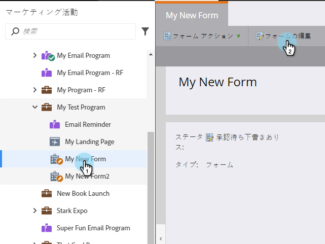
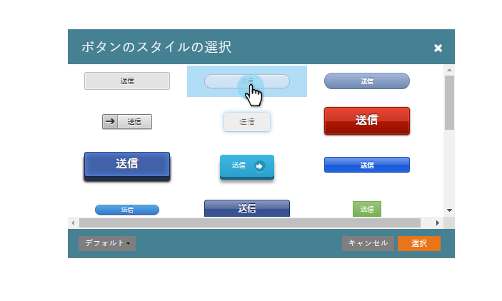
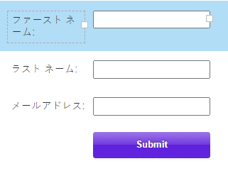

# 送信ボタンのスタイルとカラーの変更 {#change-submit-button-style-and-color}

標準の送信ボタンがさえないと感じる場合や、もっと豪華なものが必要な場合は、使いやすい様々なボタンスタイルから自由に選択できます。

1. **[!UICONTROL マーケティングアクティビティ]**&#x200B;に移動します。

   

1. フォームを選択し、「**[!UICONTROL フォームの編集]**」をクリックします。

   

1. 「**[!UICONTROL 送信]**」ボタンを選択して、ボタンのスタイルの横にある「**[!UICONTROL 編集]**」をクリックします。

   

   >[!TIP]
   >
   >送信ボタンを左または右にドラッグして、位置を変更できます。

1. ボタンのスタイルを選択します（上下にスクロール）。

   

1. カラーはデフォルトのままにすることも、カスタマイズすることもできます。

   

   >[!TIP]
   >
   >カラーコードを手動で入力することもできます。

1. 「**[!UICONTROL 選択]**」をクリックします。

   

1. 「**[!UICONTROL 終了]**」をクリックします。

   

1. 「**[!UICONTROL 承認して閉じる]**」をクリックします。

   

   

   >[!NOTE]
   >
   >多くのグラフィック要素と同様に、使用しているブラウザーによってボタンが異なる場合があります。
