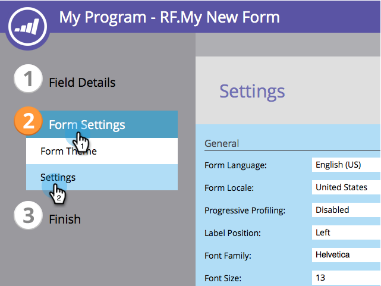
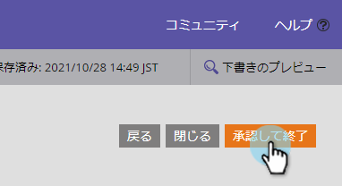
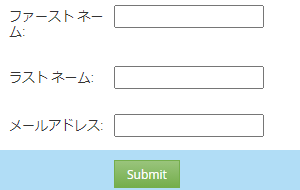

# フォームフォントファミリーの変更{#change-the-form-font-family}

Googleフォントはすごいです。フォームエディターに組み込みました。 見ろ！

>[!NOTE]
>
>この設定は、フォームラベル、入力テキストおよびリッチテキストに影響します。

1. **マーケティングアクティビティ**&#x200B;に移動します。

   

1. フォームを選択し、「**フォームを編集**」をクリックします。

   

1. 「**フォーム設定**」で、「**設定**」を選択します。

   

1. 使用する&#x200B;**フォントファミリー**&#x200B;を選択します。

   >[!TIP]
   >
   >[Googleフォント](https://www.google.com/fonts)の一群が使えます。

   

1. 「**完了**」をクリックします。

   

1. 「**承認して**&#x200B;を閉じる」をクリックします。

   >[!NOTE]
   >
   >フォームをランディングページで使用するには、承認する必要があります。

   

   >[!NOTE]
   >
   >フォームの変更によって作成されたランディングページのドラフトを必ず承認してください。

   

フォーム上のフォントファミリーを変更するのがどの程度簡単だったかを確認する これでフォームのフォントサイズを変更する方法を学びましょう

>[!MORELIKETHIS]
>
>[フォームのフォントサイズの変更](/help/marketo/product-docs/demand-generation/forms/form-design/change-the-form-font-size.md)
