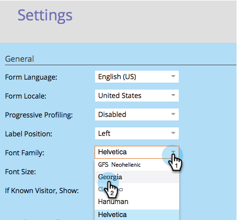
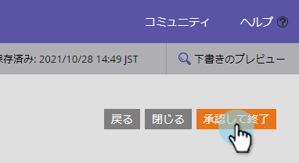
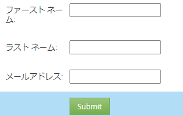

# フォームフォントファミリの変更 {#change-the-form-font-family}

Google Fontsは、フォームエディターに組み込まれています。

>[!NOTE]
>
>この設定は、フォームラベル、入力テキスト、リッチテキストに影響します。

1. **[!UICONTROL マーケティングアクティビティ]**&#x200B;に移動します。

   

1. フォームを選択し、「**[!UICONTROL フォームの編集]**」をクリックします。

   

1. 「**[!UICONTROL フォームの設定]**」で「**[!UICONTROL 設定]**」を選択します。

   

1. 望みの&#x200B;**[!UICONTROL フォントファミリ]**&#x200B;を選択します。

   >[!TIP]
   >
   >多数の [Google フォント](https://fonts.google.com/){target="_blank"}を使用できます。

   

1. 「**[!UICONTROL 終了]**」をクリックします。

   

1. 「**[!UICONTROL 承認して閉じる]**」をクリックします。

   >[!NOTE]
   >
   >ランディングページでフォームを使用するには、承認が必要です。

   

   >[!NOTE]
   >
   >必ず、フォームの変更によって作成されたランディングページのドラフトを承認してください。

   

>[!MORELIKETHIS]
>
>[フォームのフォントサイズの変更](/help/marketo/product-docs/demand-generation/forms/form-design/change-the-form-font-size.md)
