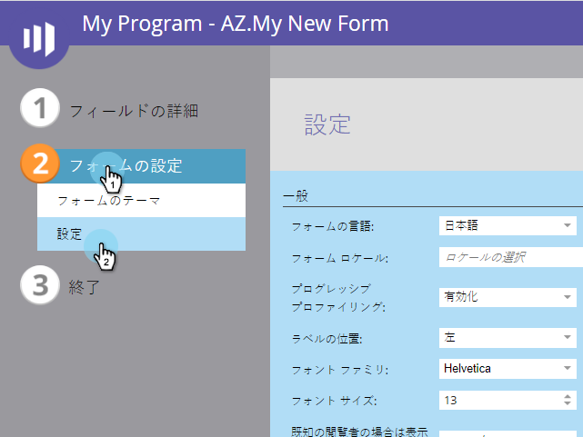
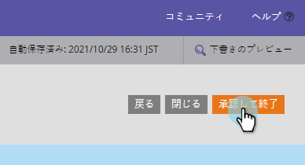

# フォームのフォントサイズの変更 {#change-the-form-font-size}

Marketorでは、フォームの外観を簡単にカスタマイズできます。 フォントサイズを変更することもできます。 これが方法です。

>[!TIP]
>
>この設定は、フォームラベル、入力テキストおよび送信ボタンテキストに影響します。

1. 「 **マーケティング** アクティビティ ****」に移動します。

   

1. フォームを選択し、「 **Edit** Form ****」をクリックします。

   

1. 「 **フォーム****設定**」で、「 **設定**」を選択します。

   

1. 使用する「 **フォント****サイズ** 」を選択します。

   

1. 「 **完了**」をクリックします。

   

1. 「 **承認して閉じる**」をクリックします。

   >[!NOTE]
   >
   >フォームをランディングページで使用するには、承認する必要があります。

   

   >[!NOTE]
   >
   >**Reminder**
   >
   >
   >フォームの変更によって作成されたランディングページのドラフトを必ず承認してください。

   

ケーキ切れ！ これを持ってる。