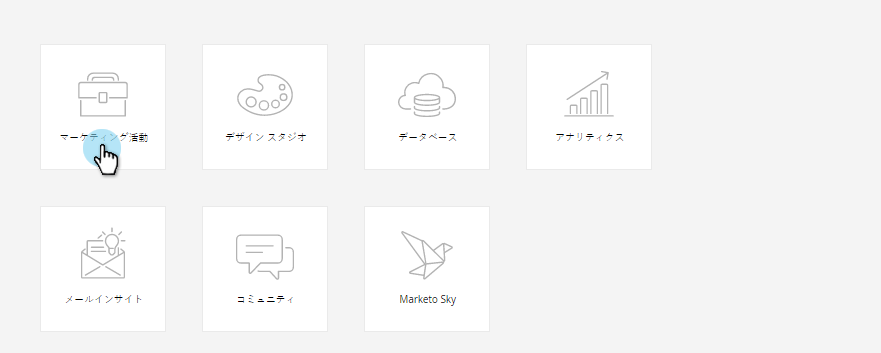
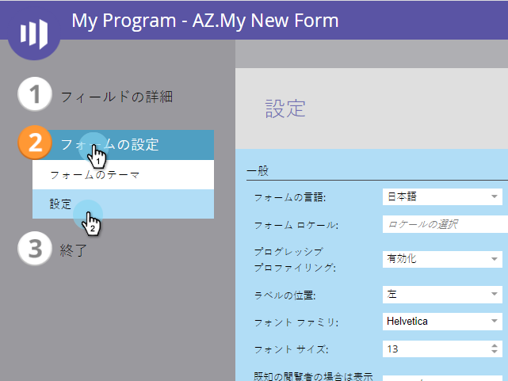
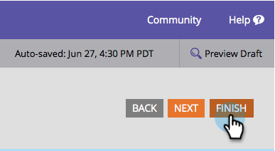
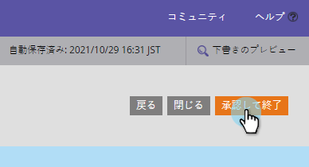

# フォームのフォントサイズの変更 {#change-the-form-font-size}

Marketo を使用すると、フォームの外観と操作性を簡単にカスタマイズできます。 フォントサイズを変更したいかもしれません。 手順は以下のとおりです。

>[!TIP]
>
>この設定は、フォームラベル、入力テキスト、送信ボタンのテキストに影響します。

1. **[!UICONTROL マーケティングアクティビティ]**&#x200B;に移動します。

   

1. フォームを選択し、「**[!UICONTROL フォームの編集]**」をクリックします。

   

1. 「**[!UICONTROL フォームの設定]**」で「**[!UICONTROL 設定]**」を選択します。

   

1. 望みの&#x200B;**[!UICONTROL フォントサイズ]**&#x200B;を選択します。

   

1. 「**[!UICONTROL 終了]**」をクリックします。

   

1. 「**[!UICONTROL 承認して閉じる]**」をクリックします。

   >[!NOTE]
   >
   >ランディングページでフォームを使用するには、承認が必要です。

   

   >[!NOTE]
   >
   >必ず、フォームの変更によって作成されたランディングページのドラフトを承認してください。

   
