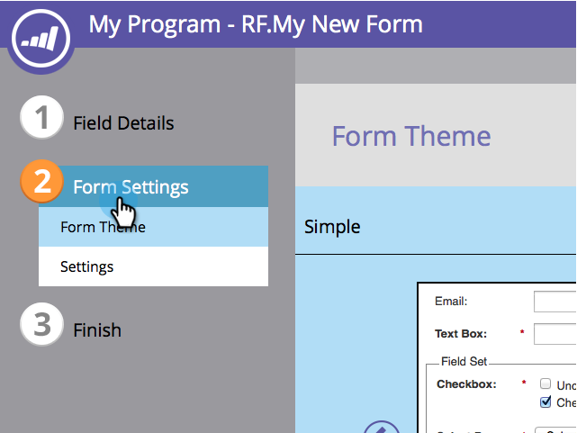
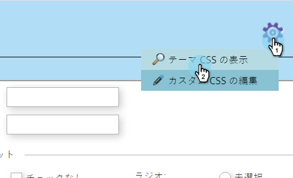
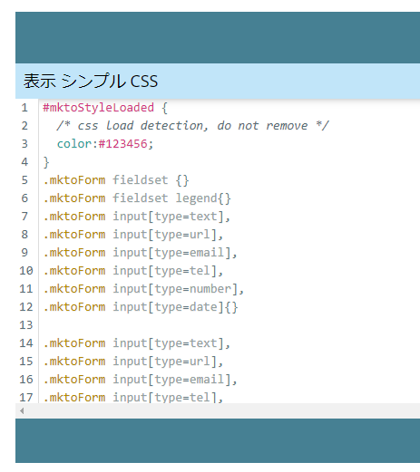
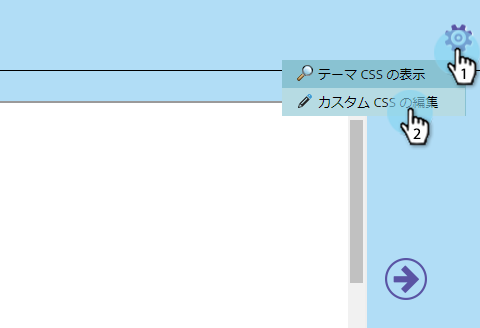

# フォームテーマのCSSの編集 {#edit-the-css-of-a-form-theme}

いくつかの事前ビルド [テーマを選択できます](../../../../product-docs/demand-generation/forms/creating-a-form/select-a-form-theme.md)。 ただし、CSSの編集が好きな場合は、必要な変更を行うことができます。 これが方法です。

>[!NOTE]
>
>この方法を試す場合は、CSSを知っていることを確認してください。マーケティングサポートは、カスタムコーディングを支援するようには設定されていません。 また、変更内容は、現在編集中のフォームにのみ適用されます。

1. 「 **マーケティング** アクティビティ ****」に移動します。

   

1. フォームを選択し、「 **Edit** Form ****」をクリックします。

   

1. 「 **フォーム****設定**」に移動します。

   

1. 変更を行うテーマを選択します。

   

1. 歯車アイコンの下で、「 **表示テーマCSS**」をクリックします。

   

1. このCSSを自由にカット/ペーストして、独自のエディタに貼り付けてください。 読み取り専用なので、オーバーライドCSSのみ必要です。

   

1. 「 **閉じる**」をクリックします。

   

1. 歯車アイコンの下で、「 **カスタム****** CSSを編集」をクリックします ****。

   

1. カスタムCSSを入力します。 全てを必要とするのではなく違う部分だけです

   

1. 終了したら、「 **保存**」をクリックします。

   

1. カスタマイズしたフォームを表示するには、「 **プレビュー******&#x200B;ドラフト」をクリックします。

   

それだ！
