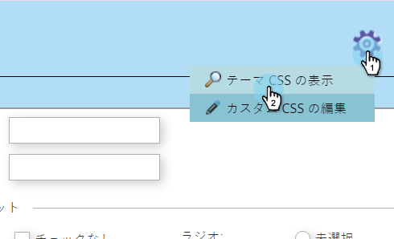
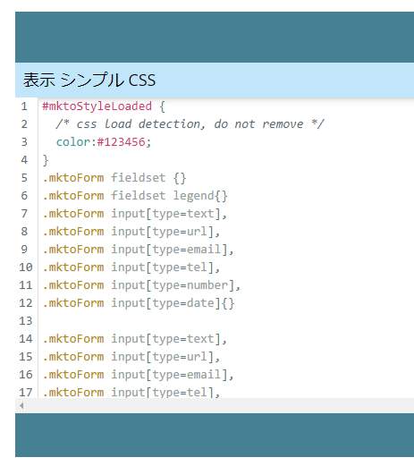
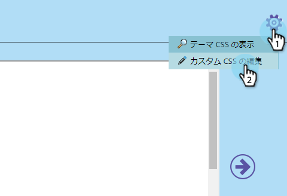
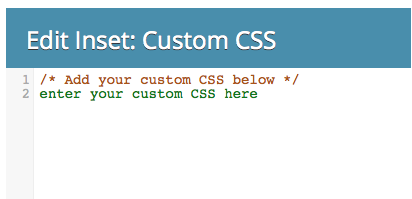

# フォームテーマの CSS の編集 {#edit-the-css-of-a-form-theme}

事前にビルドされた[選択できるテーマ](/help/marketo/product-docs/demand-generation/forms/creating-a-form/select-a-form-theme.md)がいくつかあります。 ただし、CSS を編集するのがお好きな方は、必要な変更をおこなうことができます。 手順は以下のとおりです。

>[!NOTE]
>
>Marketo サポートはカスタムコーディングを支援できないので、これを試す場合は、CSS を知っておく必要があります。 また、変更した内容は、現在編集中のフォームにのみ適用されます。

1. **[!UICONTROL マーケティングアクティビティ]**&#x200B;に移動します。

   

1. フォームを選択し、「**[!UICONTROL フォームの編集]**」をクリックします。

   

1. 「**[!UICONTROL フォームの設定]**」に移動します。

   

1. 変更を加えるテーマを選択します。

   

1. 歯車アイコンの下にある「**[!UICONTROL テーマ CSS を表示]**」をクリックします。

   

1. このCSSを独自のエディターにコピーできます。 読み取り専用なので、CSSを上書きするだけで済みます。

   

1. 「**[!UICONTROL 閉じる]**」をクリックします。

   

1. 歯車アイコンの下にある「**[!UICONTROL カスタム CSS を編集]**」をクリックします。

   

1. カスタム CSS を入力します。 すべてではなく違う部分だけが必要です。

   

1. 完了したら、「**[!UICONTROL 保存]**」をクリックします。

   

1. カスタマイズしたフォームを確認するには、「**[!UICONTROL ドラフトをプレビュー]**」をクリックします。

   
