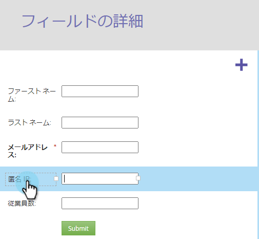

# フォーム内のラベル／フィールド幅のサイズ変更 {#resize-label-field-width-in-a-form}

フィールドラベルの幅とフィールドの幅の両方をサイズ変更する方法は 2 つあります。

## 幅をドラッグ＆ドロップする {#drag-and-drop-the-width}

1. [フォームエディター](/help/marketo/product-docs/demand-generation/forms/form-actions/edit-a-form.md)で、サイズを変更するフィールドを選択します。

   

1. サイズを変更するには、ラベルの隅またはフィールドの隅をドラッグします。

   

## 手動で幅を入力する {#enter-the-width-manually}

1. サイズを変更するフィールドを選択します。

   

1. [!UICONTROL  ラベル幅]、[!UICONTROL  フィールド幅]、またはその両方のピクセル値を入力します。

   

