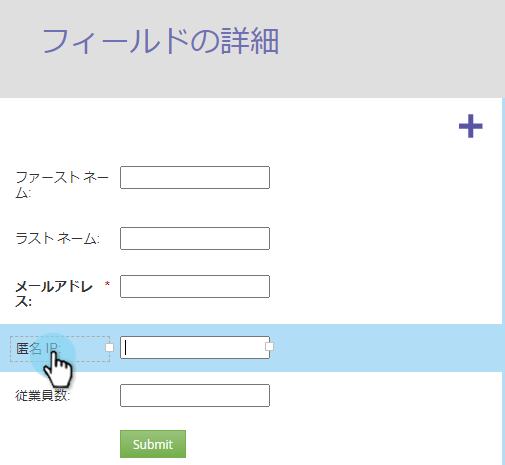

# フォーム内のラベル/フィールドの幅のサイズを変更{#resize-label-field-width-in-a-form}

フィールドラベルの幅とフィールドの幅の両方をサイズ変更する方法は2つあります。

## 幅をドラッグ&amp;ドロップ{#drag-and-drop-the-width}

1. [フォームエディター](/help/marketo/product-docs/demand-generation/forms/form-actions/edit-a-form.md)で、サイズを変更するフィールドを選択します。

   

1. ラベルの隅またはフィールドの隅をドラッグして、サイズを変更します。

   

## 幅を手動で入力{#enter-the-width-manually}

1. サイズを変更するフィールドを選択します。

   

1. 「ラベルの幅」または「フィールドの幅」（あるいはその両方）にピクセル値を入力します。

   

OK！簡単だろ？
