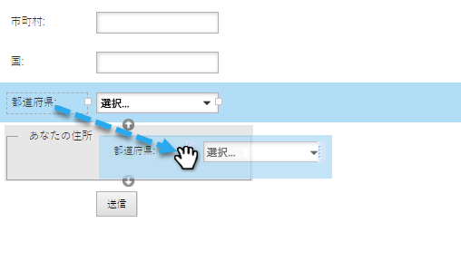

# フ追加ォームへのフィールドセット {#add-a-fieldset-to-a-form}

フィールドセットは涼しい。 複数のフィールドをグループ化します。 ブロック全体も一度にコントロールできる！

1. 「 **マーケティング** アクティビティ ****」に移動します。

   

1. フォームを選択し、「 **Edit** Form ****」をクリックします。

   

1. 「 **+」** 記号をクリックし、「 **Fieldset**」を選択します。

   

1. フ **ィールドセットを選択し** 、 **ラベルを入力します**。

   

1. 目的のフィールドを **fieldset内にドラッグします**。

   

1. これが終わったら次のようになります。

   

あった！

>[!TIP]
>
>別のフィールドに応じて、フィールドセット全体の表示/非表示を動的に切り替えることができます。 表示 [規則について説明します](dynamically-toggle-visibility-of-a-form-field.md)。

