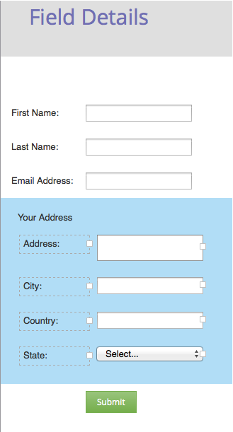

# フォームにフィールドセットを追加する {#add-a-fieldset-to-a-form}

フィールドセットは素晴らしいです。フィールドセットは多くのフィールドをグループ化します。グループ全体を一度に制御することもできます。

1. 「**マーケティングアクティビティ**」に移動します。

   

1. フォームを選択し、「**フォームの編集**」をクリックします。

   

1. **+** 記号をクリックし、「**フィールドセット**」を選択します。

   

1. 追加した&#x200B;**フィールドセット**&#x200B;を選択し、「**ラベル**」に値を入力します。

   

1. この&#x200B;**フィールドセット**&#x200B;に含めるフィールドをドラッグします。

   

1. 次の図は、この操作をおこなった状態を表します。

   

これで手順は完了です。

>[!TIP]
>
>他のフィールドの値に応じて、フィールドセット全体の表示設定を動的に変えることができます。詳細は、「[表示設定ルール](/help/marketo/product-docs/demand-generation/forms/form-fields/dynamically-toggle-visibility-of-a-form-field.md)」を参照してください。
