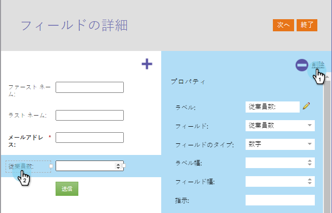
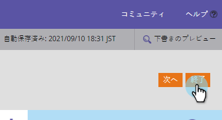

# フォーム内のフィールドの削除 {#delete-a-field-in-a-form}

不要になったフィールドがフォームにある場合は、簡単に削除できます。 これが方法です。

1. 「 **マーケティング** アクティビティ ****」に移動します。

   

1. フォームを選択し、「 **Edit** Form ****」をクリックします。

   

1. フィールドを選択し、 **削除** アイコンをクリックします。

   
「完了」をクリックします。
   

1. 「 **承認して閉じる」をクリックします。**

   

>[!NOTE]
>
>**Reminder**
>
>フォームの変更によって [作成されたランディングページのドラフトを忘れずに](../../../../product-docs/demand-generation/landing-pages/understanding-landing-pages/approve-unapprove-or-delete-a-landing-page.md) 承認してください。

フィールドを削除するのはどのくらい難しいと思いましたか？