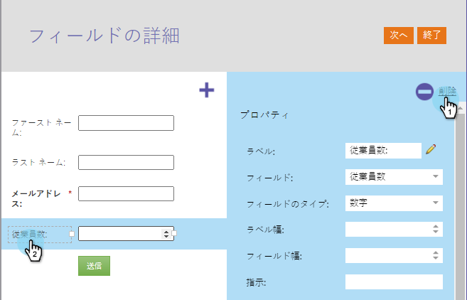
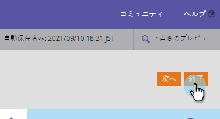
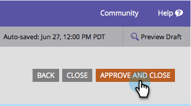

# フォーム内のフィールドの削除 {#delete-a-field-in-a-form}

フォーム上に不要になったフィールドがある場合は、簡単に削除できます。 手順は以下のとおりです。

1. **[!UICONTROL マーケティングアクティビティ]**&#x200B;に移動します。

   

1. フォームを選択して、「**[!UICONTROL フォームを編集]**」をクリックします。

   

1. フィールドを選択し、**[!UICONTROL 削除]**&#x200B;アイコンをクリックします。

   

1. 「**[!UICONTROL 終了]**」をクリックします。

   

1. 「**[!UICONTROL 承認して閉じる]**」をクリックします。

   

>[!NOTE]
>
>必ず、フォームの変更によって作成された[ランディングページのドラフトを承認](/help/marketo/product-docs/demand-generation/landing-pages/understanding-landing-pages/approve-unapprove-or-delete-a-landing-page.md)してください。
