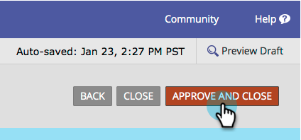
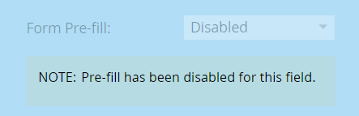

# フォームフィールドの事前入力を無効にする {#disable-pre-fill-for-a-form-field}

Web 訪問者が既知の（cookie が有効）場合、Marketo のフォームはデフォルトで、フィールドにその情報を事前に入力します。 これをオフにするには、次の方法を使用します。

>[!NOTE]
>
>**フォームの事前入力**&#x200B;はデフォルトで有効になっています。 ランディングページレベルの事前入力設定と管理者レベルの事前入力設定は、フォームレベルの設定より優先されます。
>
>優先順位：管理者、ランディングページ、フォーム（左が優先）

## 事前入力を無効にする方法 {#how-to-disable-pre-fill}

1. **[!UICONTROL マーケティングアクティビティ]**&#x200B;に移動します。

   

1. フォームを選択し、「**[!UICONTROL フォームの編集]**」をクリックします。

   

   >[!CAUTION]
   >
   >フォームを独自のページに埋め込むと、フォームの事前入力が機能しません。 これは、Marketo のランディングページでのみ機能します。

1. いずれかのフィールドを選択し、**[!UICONTROL フォームの事前入力]**&#x200B;を&#x200B;**[!UICONTROL 無効]**&#x200B;に設定します。

   

   >[!TIP]
   >
   >また、ランディングページレベルまたは管理者レベルで、フォームの事前入力を無効にすることもできます。

1. 「**[!UICONTROL 終了]**」をクリックします。

   

1. 「**[!UICONTROL 承認して閉じる]**」をクリックします。

   

## 機密フィールド {#sensitive-fields}

[フィールドを機密としてマーク](/help/marketo/product-docs/administration/field-management/mark-a-field-as-sensitive.md)すると、値がフォームに事前入力されないように設定できます。これは、「事前入力」オプションに表示されます。

