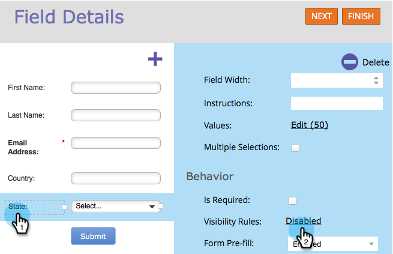
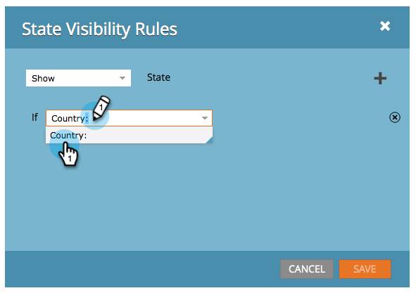
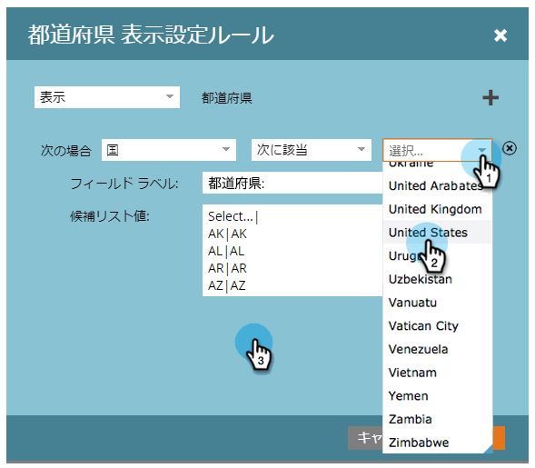
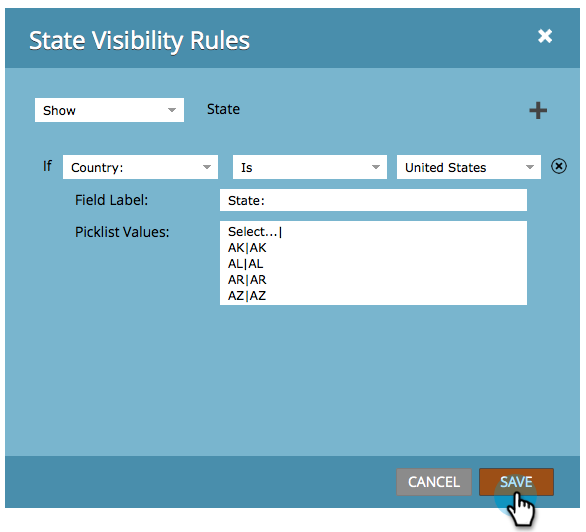

# フォームフィールドの表示設定を動的に切り替える {#dynamically-toggle-visibility-of-a-form-field}

>[!PREREQUISITES]
>
>* [フォームに国選択リストを追加する](/help/marketo/product-docs/demand-generation/forms/form-actions/add-a-country-picklist-to-your-form.md)

Marketo フォームの素晴らしい機能の 1 つは、フォームフィールドや[フィールドセット](/help/marketo/product-docs/demand-generation/forms/form-fields/add-a-fieldset-to-a-form.md)の表示設定を動的に切り替えられることです。

>[!NOTE]
>
>**例**
>この例では、**国**&#x200B;が「米国」として選択されていない限り、「**州**」フィールドを非表示にします。

1. 「**マーケティングアクティビティ**」に移動します。

   

1. フォームを選択し、「**フォームの編集**」をクリックします。

   

1. 表示設定を動的に切り替えるフィールドを選択し、「**表示設定ルール**」リンクをクリックします。

   

1. 条件として指定するフィールドを検索して選択します。

   

1. 演算子を選択します。

   >[!TIP]
   >
   >「次の語句で始まる」のようなあいまい一致を選択できるので、これは素晴らしいです。

   

1. 検索する値を選択し、ドロップダウンの外側をクリックします。

   

   >[!TIP]
   >
   >ドロップダウンを開いた状態で複数の値をクリックして選択できます。例えば、「米国」と「カナダ」を選択できます。

   >[!NOTE]
   >
   >すでに、「国」のフィールドタイプを候補リストに変換し、[すべての国を値として追加する](/help/marketo/product-docs/demand-generation/forms/form-actions/add-a-country-picklist-to-your-form.md)作業を完了しているものとします。

1. 「**保存**」をクリックします。

   

これで手順は完了です。訪問者がこのフィールドに入力し、「国」で「米国」を選択すると、選択肢が指定された状態で「州」フィールドが動的に表示されます。
