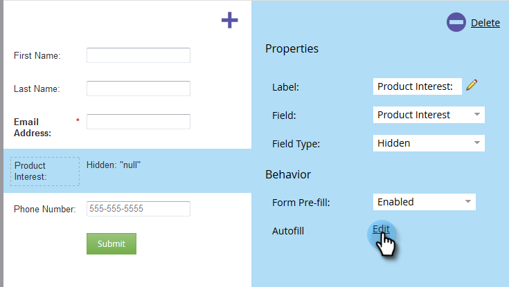
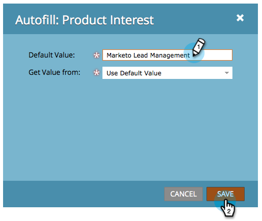
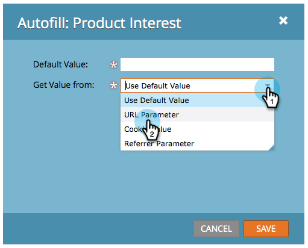
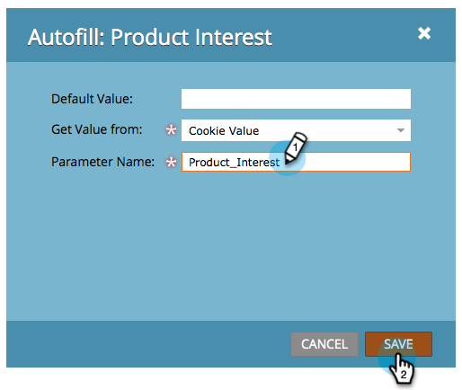
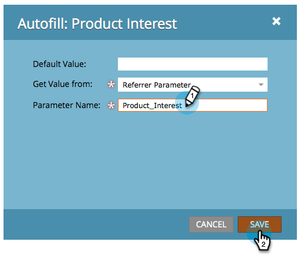
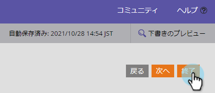

# 非表示フォームフィールドの値を設定する {#set-a-hidden-form-field-value}

非表示のフィールドは、通常、動的に設定されます。 フォームの入力者には表示されません。 その値の設定方法を説明しましょう。

>[!PREREQUISITES]
>
>[フォームフィールドを非表示に設定](/help/marketo/product-docs/demand-generation/forms/form-fields/set-a-form-field-as-hidden.md)

## フィールドの選択 {#select-the-field}

1. 非表示フィールドを選択して、「**[!UICONTROL 自動入力]**」で［**[!UICONTROL 編集]**」をクリックします。

   

## デフォルト値の使用 {#use-default-value}

「**[!UICONTROL デフォルト値]**&#x200B;の使用」を選択すると、このフォームの送信時に常に使用される特定の値をハードコードできます。 「**[!UICONTROL デフォルト値]**」を入力して、「**[!UICONTROL 保存]**」をクリックします。

## URL パラメーター {#url-parameter}

ユーザーがフォームの入力時に閲覧しているページから URL パラメーター（クエリ文字列）を取り込む場合は、**[!UICONTROL URL パラメーター]**&#x200B;を使用して非表示のフィールドに値を入力できます。

>[!NOTE]
>
>パラメーターは技術的なものです。 それらを理解すれば、それらは強力になります。 この [Wikipedia の「Query Strings」](https://en.wikipedia.org/wiki/Query_string)のページなどが参考になるでしょう。

1. **[!UICONTROL 取得値のタイプ]**&#x200B;として「**[!UICONTROL URL パラメーター]**」を選択します。

   

1. 「**[!UICONTROL パラメーター名]**」を入力して、「**[!UICONTROL 保存]**」をクリックします。

   

>[!TIP]
>
>URL パラメーターが見つからない場合に備えて「**[!UICONTROL デフォルト値]**」を入力することも可能です。

## Cookie 値 {#cookie-value}

Cookieにデータを保存する場合は、**[!UICONTROL Cookie値]**&#x200B;を使用して、フォームの送信時にデータを取得できます。

1. 「**[!UICONTROL 値の取得元]**」で「**[!UICONTROL Cookie 値]**」を選択します。

   

1. 目的の cookie の「**[!UICONTROL パラメーター名]**」を入力し、「**[!UICONTROL 保存]**」をクリックします。

   

   >[!TIP]
   >
   >パラメーター／cookie が見つからない場合に備えて「**[!UICONTROL デフォルト値]**」を入力することも可能です。

## リファラーパラメーター {#referrer-parameter}

フォームに入力する前に訪問者が来たページからデータを取り込む場合は、**[!UICONTROL リファラーパラメーター]**&#x200B;を使用できます。

1. 「**[!UICONTROL 値の取得元]**」を「**[!UICONTROL リファラーパラメーター]**」に設定します。

   

1. リファラー URL から取り出す「**[!UICONTROL パラメーター名]**」を入力し、「**[!UICONTROL 保存]**」をクリックします。

   

   >[!TIP]
   >
   >URL パラメーターが見つからない場合に備えて「**[!UICONTROL デフォルト値]**」を入力することも可能です。

1. 「**[!UICONTROL 終了]**」をクリックします。

   

1. 「**[!UICONTROL 承認して閉じる]**」をクリックします。

   
