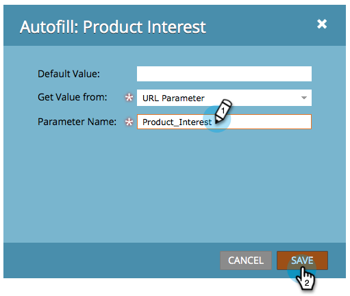

# 非表示フォームフィールドの値を設定する {#set-a-hidden-form-field-value}

非表示のフィールドは、通常、動的に設定されます。フォームの入力者には表示されません。その値の設定方法を説明しましょう。

>[!PREREQUISITES]
>
>[フォームフィールドを非表示に設定する](/help/marketo/product-docs/demand-generation/forms/form-fields/set-a-form-field-as-hidden.md)>
>

## フィールドの選択 {#select-the-field}

1. 非表示フィールドを選択して、「**自動入力**」で［**編集**」をクリックします。

   

## デフォルト値の使用 {#use-default-value}

「デフォルト値の使用」を選択すると、このフォームの送信時に常に使用される特定の値をハードコードできます。「デフォルト値」を入力して、「保存」をクリックします。

## URL パラメーター {#url-parameter}

ユーザーがフォームの入力時に閲覧しているページから URL パラメーター（クエリー文字列）を取り込む場合は、**URL パラメーター**&#x200B;を使用して非表示のフィールドに値を入力できます。

>[!NOTE]
>
>パラメーターは少し専門的に思えますが、一度使えるようになれば、強力なものです。この [Wikipedia の「Query Strings」](https://en.wikipedia.org/wiki/Query_string)のページなどが参考になるでしょう。

1. **取得値のタイプ**&#x200B;として「**URL パラメーター**」を選択します。

   

1. 「**パラメーター名**」を入力して、「**保存**」をクリックします。

   

>[!TIP]
>
>URL パラメーターが見つからない場合に備えて「デフォルト値」を入力することも可能です。

## Cookie 値 {#cookie-value}

Cookie にデータを保存する場合は、**Cookie 値**&#x200B;を使用して、フォームの送信時にデータを取得できます。

1. 「**値の取得元**」で「**Cookie 値**」を選択します。

   

1. 目的の Cookieの「パラメーター名」を入力し、「**保存**」をクリックします。

   

   >[!TIP]
   >
   >URL パラメーターが見つからない場合に備えて「デフォルト値」を入力することも可能です。

## リファラーパラメーター {#referrer-parameter}

フォームに入力する前に訪問者が来たページからデータを取り込む場合は、**リファラーパラメーター**&#x200B;を使用できます。

1. 「**値の取得元**」を「**リファラーパラメーター**」に設定します。

   

1. リファラー URL から取り出す「**パラメーター名**」を入力し、「**保存**」をクリックします。

   

   >[!TIP]
   >
   >URL パラメーターが見つからない場合に備えて「**デフォルト値**」を入力することも可能です。

1. 「**終了**」をクリックします。

   

1. 「**承認して閉じる**」をクリックします。

   
