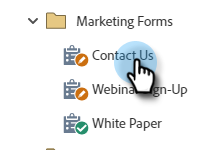

# Marketo Formsでの CAPTCHA の有効化 {#enable-captcha-in-marketo-forms}

CAPTCHA は、フォームごとに有効/無効を切り替えることができます。

1. 目的のフォームを検索して選択します。

   

1. クリック **下書きの編集** （フォームが既に承認されている場合は、「ドラフトを作成」をクリックします）。

   

1. クリック **フォーム設定**&#x200B;を、 **設定**.

   

1. CAPTCHA ドロップダウンを開き、「 」を選択します。 **有効**.

   

1. 「**終了**」をクリックします。

   

1. 「**承認して閉じる**」をクリックします。

   
